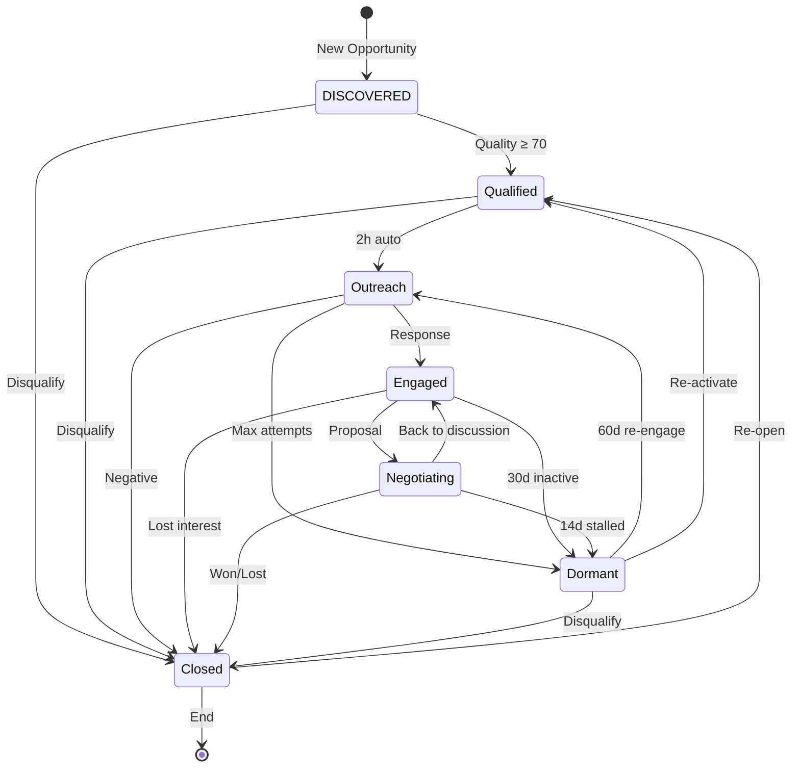

# Opportunity Lifecycle State Machine - Complete Documentation

┌─────────────────────────────────────────────────────────────────────┐
│                 OPPORTUNITY LIFECYCLE STATE MACHINE                  │
└─────────────────────────────────────────────────────────────────────┘

                            ┌──────────────┐
                            │  DISCOVERED  │ (Entry)
                            └──────┬───────┘
                                   │ Quality ≥ 70
                                   ▼
                            ┌──────────────┐
                      ┌────►│  QUALIFIED   │
                      │     └──────┬───────┘
                      │            │ 2h auto
                      │            ▼
                      │     ┌──────────────┐
                      │  ┌──┤   OUTREACH   │──┐ Max attempts
                      │  │  └──────┬───────┘  │
                      │  │         │ Response │
                      │  │         ▼          │
                      │  │  ┌──────────────┐  │
           Re-engage  │  └─►│   ENGAGED    │  │ 30d inactive
                      │     └──────┬───────┘  │
                      │            │ Proposal │
                      │            ▼          │
                      │     ┌──────────────┐  │
                      │  ┌─►│ NEGOTIATING  │  │ 14d stalled
                      │  │  └──────┬───────┘  │
                      │  │         │ Won/Lost │
                      │  │         ▼          │
                      │  │  ┌──────────────┐  │
                      │  │  │    CLOSED    │◄─┘
                      │  │  │  (Terminal)  │
                      │  │  └──────────────┘
                      │  │         ▲
                      │  └─────────┼─────── Back to discussion
                      │            │
                      │     ┌──────────────┐
                      └────►│   DORMANT    │
                            └──────────────┘
                               60d re-engage

States:
  • DISCOVERED  - Opportunity identified, not yet qualified
  • QUALIFIED   - Meets quality criteria, ready for outreach
  • OUTREACH    - Active outreach in progress
  • ENGAGED     - Prospect responding, showing interest
  • NEGOTIATING - Active deal negotiation
  • DORMANT     - Inactive, potential re-engagement
  • CLOSED      - Terminal (WON/LOST/DISQUALIFIED)

# Lifecycle States Details

## DISCOVERED

**Description**: Opportunity identified but not yet qualified

**Properties**:
- Entry State: Yes
- Terminal State: No
- Color: #94a3b8

**Auto Actions**:
- run_research
- calculate_quality
- schedule_qualification

**Valid Transitions To**: QUALIFIED, CLOSED

---

## QUALIFIED

**Description**: Opportunity meets quality criteria

**Properties**:
- Entry State: No
- Terminal State: No
- Color: #60a5fa

**Auto Actions**:
- identify_contacts
- generate_strategy
- calculate_tiers

**Valid Transitions To**: OUTREACH, CLOSED

---

## OUTREACH

**Description**: Active outreach in progress

**Properties**:
- Entry State: No
- Terminal State: No
- Color: #f59e0b

**Auto Actions**:
- generate_messages
- track_attempts
- schedule_followups

**Valid Transitions To**: ENGAGED, DORMANT, CLOSED

---

## ENGAGED

**Description**: Prospect has responded and showing interest

**Properties**:
- Entry State: No
- Terminal State: No
- Color: #10b981

**Auto Actions**:
- track_engagement
- update_score
- suggest_next_steps

**Valid Transitions To**: NEGOTIATING, DORMANT, CLOSED

---

## NEGOTIATING

**Description**: Active deal negotiation

**Properties**:
- Entry State: No
- Terminal State: No
- Color: #8b5cf6

**Auto Actions**:
- track_stage
- monitor_timeline
- alert_stalls
- calculate_probability

**Valid Transitions To**: ENGAGED, DORMANT, CLOSED

---

## DORMANT

**Description**: Inactive opportunity with re-engagement potential

**Properties**:
- Entry State: No
- Terminal State: No
- Color: #6b7280

**Auto Actions**:
- calculate_reengagement_score
- schedule_reengagement
- monitor_triggers

**Valid Transitions To**: OUTREACH, QUALIFIED, CLOSED

---

## CLOSED

**Description**: Terminal state - opportunity concluded

**Properties**:
- Entry State: No
- Terminal State: Yes
- Color: #ef4444

**Auto Actions**:
- record_reason
- calculate_metrics
- archive_data
- update_analytics

**Valid Transitions To**: QUALIFIED

---

# Transition Matrix

| From \ To | DISCOVERED | QUALIFIED | OUTREACH | ENGAGED | NEGOTIATING | DORMANT | CLOSED |
|---|---|---|---|---|---|---|---|
| DISCOVERED | - | ✓ | - | - | - | - | ✓ |
| QUALIFIED | - | - | ✓ | - | - | - | ✓ |
| OUTREACH | - | - | - | ✓ | - | ✓ | ✓ |
| ENGAGED | - | - | - | - | ✓ | ✓ | ✓ |
| NEGOTIATING | - | - | - | ✓ | - | ✓ | ✓ |
| DORMANT | - | ✓ | ✓ | - | - | - | ✓ |
| CLOSED | - | ✓ | - | - | - | - | - |

## Mermaid Diagram

---
Generated: 2025-11-18T15:08:47.224Z
