# Agent Hub Architecture Specification
## Sprint 29 - Phase 3: Centralized Agentic Hub Design

**Version**: 1.0
**Date**: 2025-11-16
**Status**: Design Specification
**Target**: Phase 3 Completion (0% → 50%)

---

## Table of Contents

1. [Executive Summary](#executive-summary)
2. [System Overview](#system-overview)
3. [Architecture Diagrams](#architecture-diagrams)
4. [Tool Registry](#tool-registry)
5. [Request Router](#request-router)
6. [Response Aggregator](#response-aggregator)
7. [MCP Server Integration](#mcp-server-integration)
8. [Multi-Tool Workflows](#multi-tool-workflows)
9. [Error Handling & Resilience](#error-handling--resilience)
10. [API Contracts](#api-contracts)
11. [Security & Authorization](#security--authorization)
12. [Monitoring & Observability](#monitoring--observability)
13. [Implementation Plan](#implementation-plan)

---

## Executive Summary

### Purpose

The **Agent Hub** is a centralized orchestration layer that coordinates SIVA's 4 decision primitives (CompanyQualityTool, ContactTierTool, TimingScoreTool, BankingProductMatchTool) into a unified agentic system. It provides:

1. **Unified Interface**: Single entry point for all tool executions
2. **MCP Integration**: Model Context Protocol server for Claude Desktop integration
3. **Multi-Tool Workflows**: Orchestrate sequential and parallel tool execution
4. **Tool Registry**: Dynamic tool discovery, versioning, and metadata
5. **Enterprise Resilience**: Error handling, timeouts, circuit breakers, fallbacks

### Business Value

- **For Claude Desktop Users**: Direct integration via MCP - execute SIVA tools natively in Claude conversations
- **For Multi-Tool Use Cases**: Intelligent lead scoring requires combining all 4 tools (company quality + contact tier + timing + banking products)
- **For Platform Extensibility**: New tools can be registered without changing orchestrator code
- **For Enterprise Reliability**: Centralized error handling, monitoring, and SLA enforcement

### Success Criteria

| Metric | Target | Measurement |
|--------|--------|-------------|
| **MCP Tool Availability** | 4/4 tools accessible via Claude Desktop | MCP client connection test |
| **Multi-Tool Workflow Latency** | ≤3s P95 (all 4 tools sequential) | Prometheus histogram |
| **Tool Registry Uptime** | 99.9% | Uptime monitoring |
| **Error Rate** | <0.1% for individual tools | Sentry error tracking |
| **Workflow Success Rate** | >99% | Decision logs analysis |

---

## System Overview

### High-Level Architecture

```mermaid
graph TB
    subgraph "External Clients"
        CD[Claude Desktop<br/>MCP Client]
        API[REST API<br/>Direct Clients]
        WF[Workflow Engine<br/>Multi-tool]
    end

    subgraph "Agent Hub Layer"
        MCP[MCP Server<br/>Protocol Handler]
        Router[Request Router<br/>Tool Selection]
        Registry[Tool Registry<br/>Discovery & Metadata]
        Aggregator[Response Aggregator<br/>Result Composition]
        WFE[Workflow Executor<br/>Sequential/Parallel]
    end

    subgraph "SIVA Tools Layer"
        CQ[CompanyQualityTool<br/>v2.0]
        CT[ContactTierTool<br/>v2.0]
        TS[TimingScoreTool<br/>v1.0]
        BPM[BankingProductMatchTool<br/>v1.0]
    end

    subgraph "Supporting Infrastructure"
        AB[A/B Testing<br/>ABTestingHelper]
        SA[Scoring Adjustments<br/>Reinforcement Learning]
        DL[Decision Logger<br/>agent_decisions table]
        SM[Shadow Mode<br/>Rule Engine Comparison]
    end

    CD -->|MCP Protocol| MCP
    API -->|HTTP POST| Router
    WF -->|Workflow Definition| WFE

    MCP -->|Translate| Router
    Router -->|Lookup| Registry
    Router -->|Route| WFE
    WFE -->|Execute| CQ
    WFE -->|Execute| CT
    WFE -->|Execute| TS
    WFE -->|Execute| BPM

    CQ --> AB
    CQ --> SA
    CQ --> DL
    CQ --> SM

    CT --> AB
    CT --> SA
    CT --> DL
    CT --> SM

    TS --> AB
    TS --> SA
    TS --> DL
    TS --> SM

    BPM --> AB
    BPM --> SA
    BPM --> DL
    BPM --> SM

    WFE --> Aggregator
    Aggregator --> Router
    Router --> MCP
    Router --> API
    Router --> WF
```



### Component Responsibilities

| Component | Responsibility | SLA |
|-----------|---------------|-----|
| **MCP Server** | MCP protocol handling, tool registration, request translation | ≤50ms overhead |
| **Request Router** | Route requests to appropriate tools/workflows, validate inputs | ≤10ms routing decision |
| **Tool Registry** | Tool discovery, metadata, versioning, health checks | ≤5ms lookup |
| **Workflow Executor** | Multi-tool orchestration (sequential/parallel), dependency resolution | ≤2s for 4-tool workflow |
| **Response Aggregator** | Combine multi-tool results, format unified response | ≤20ms aggregation |

---

## Architecture Diagrams

### 1. Request Flow Diagram


### 2. Tool Registry Architecture

```mermaid
graph TB
    subgraph "Tool Registry"
        Reg[Registry Core<br/>In-Memory Map]
        Loader[Dynamic Loader<br/>require() / import()]
        Meta[Metadata Store<br/>Tool Specs]
        Health[Health Checker<br/>Periodic Validation]
    end

    subgraph "Tool Metadata"
        TM1[CompanyQuality<br/>name, version, schema, SLA]
        TM2[ContactTier<br/>name, version, schema, SLA]
        TM3[TimingScore<br/>name, version, schema, SLA]
        TM4[BankingProductMatch<br/>name, version, schema, SLA]
    end

    subgraph "Tool Instances"
        CQ[CompanyQualityTool<br/>Instance]
        CT[ContactTierTool<br/>Instance]
        TS[TimingScoreTool<br/>Instance]
        BPM[BankingProductMatchTool<br/>Instance]
    end

    Loader -->|Load on Startup| CQ
    Loader -->|Load on Startup| CT
    Loader -->|Load on Startup| TS
    Loader -->|Load on Startup| BPM

    Reg -->|Store| TM1
    Reg -->|Store| TM2
    Reg -->|Store| TM3
    Reg -->|Store| TM4

    TM1 -.->|Reference| CQ
    TM2 -.->|Reference| CT
    TM3 -.->|Reference| TS
    TM4 -.->|Reference| BPM

    Health -->|Periodic Check| CQ
    Health -->|Periodic Check| CT
    Health -->|Periodic Check| TS
    Health -->|Periodic Check| BPM
```

### 3. Multi-Tool Workflow Execution

```mermaid
graph TB
    subgraph "Workflow Definition"
        WD[Workflow: Full Lead Scoring<br/>4 Tools Sequential]
    end

    subgraph "Execution Steps"
        S1[Step 1: CompanyQuality<br/>Input: company data]
        S2[Step 2: ContactTier<br/>Input: contact + company]
        S3[Step 3: TimingScore<br/>Input: signal data]
        S4[Step 4: BankingProductMatch<br/>Input: company + signals]
    end

    subgraph "Result Aggregation"
        AGG[Aggregator<br/>Combine 4 Results]
        FMT[Formatter<br/>Unified Response]
    end

    subgraph "Final Output"
        OUT[Lead Score Response<br/>company_quality: 85<br/>contact_tier: Tier 1<br/>timing_score: 92<br/>banking_products: [3 matches]<br/>aggregate_confidence: 0.88]
    end

    WD --> S1
    S1 -->|quality_score: 85| S2
    S2 -->|tier: Tier 1| S3
    S3 -->|timing_score: 92| S4
    S4 -->|products: [...]| AGG

    AGG --> FMT
    FMT --> OUT
```

### 4. MCP Integration Architecture


---

## Tool Registry

### Design Principles

1. **Dynamic Loading**: Tools loaded at runtime via `require()` or `import()`
2. **Metadata-Driven**: Each tool registers with metadata (name, version, schema, SLA)
3. **Health Monitoring**: Periodic health checks (ping mechanism)
4. **Versioning Support**: Multiple versions of same tool can coexist
5. **Lazy Initialization**: Tools initialized on first request (optional)

### Tool Metadata Schema

```typescript
interface ToolMetadata {
  // Identity
  name: string;                    // e.g., "CompanyQualityTool"
  displayName: string;             // e.g., "Company Quality Evaluator"
  version: string;                 // e.g., "v2.0"

  // Classification
  primitive: string;               // e.g., "EVALUATE_COMPANY_QUALITY"
  phase: number;                   // SIVA phase (1-12)
  type: "STRICT" | "FLEX";         // STRICT = deterministic, FLEX = LLM-based

  // Schemas
  inputSchema: object;             // JSON Schema for input validation
  outputSchema: object;            // JSON Schema for output validation

  // SLA
  sla: {
    p50LatencyMs: number;          // e.g., 300
    p95LatencyMs: number;          // e.g., 900
    errorRateThreshold: number;    // e.g., 0.001 (0.1%)
  };

  // Capabilities
  capabilities: {
    abTesting: boolean;            // Supports A/B testing
    shadowMode: boolean;           // Supports rule engine shadow mode
    scoringAdjustments: boolean;   // Supports reinforcement learning
    batchExecution: boolean;       // Supports batch inputs
  };

  // Dependencies
  dependencies: string[];          // e.g., ["TimingScoreTool"] for workflows

  // Health
  status: "healthy" | "degraded" | "offline";
  lastHealthCheck: Date;
}
```

### Registry Implementation Design

```javascript
// File: server/agent-hub/ToolRegistry.js

class ToolRegistry {
  constructor() {
    this.tools = new Map();           // name -> { metadata, instance }
    this.healthCheckInterval = 60000; // 60s
    this.healthCheckTimer = null;
  }

  /**
   * Register a tool with metadata
   */
  async register(toolPath, metadata) {
    const instance = await this._loadTool(toolPath);

    // Validate tool implements execute()
    if (typeof instance.execute !== 'function') {
      throw new Error(`Tool ${metadata.name} must implement execute() method`);
    }

    this.tools.set(metadata.name, {
      metadata,
      instance,
      path: toolPath,
      registeredAt: new Date()
    });

    console.log(`✅ Registered tool: ${metadata.name} v${metadata.version}`);
  }

  /**
   * Get tool by name
   */
  getTool(name) {
    const tool = this.tools.get(name);
    if (!tool) {
      throw new Error(`Tool not found: ${name}`);
    }

    if (tool.metadata.status === 'offline') {
      throw new Error(`Tool offline: ${name}`);
    }

    return tool;
  }

  /**
   * List all registered tools
   */
  listTools() {
    return Array.from(this.tools.values()).map(t => t.metadata);
  }

  /**
   * Health check all tools
   */
  async performHealthChecks() {
    for (const [name, tool] of this.tools.entries()) {
      try {
        // Simple ping: call execute with minimal input
        const healthInput = this._getHealthCheckInput(name);
        await tool.instance.execute(healthInput);

        tool.metadata.status = 'healthy';
        tool.metadata.lastHealthCheck = new Date();
      } catch (error) {
        tool.metadata.status = 'offline';
        console.error(`❌ Health check failed for ${name}:`, error.message);
      }
    }
  }

  /**
   * Dynamic tool loading (supports both CommonJS and ES modules)
   */
  async _loadTool(toolPath) {
    try {
      // Try CommonJS first
      const module = require(toolPath);
      return new module();
    } catch (error) {
      // Fallback to ES module
      const module = await import(toolPath);
      return new module.default();
    }
  }

  /**
   * Start periodic health checks
   */
  startHealthChecks() {
    this.healthCheckTimer = setInterval(
      () => this.performHealthChecks(),
      this.healthCheckInterval
    );
  }

  /**
   * Stop health checks
   */
  stopHealthChecks() {
    if (this.healthCheckTimer) {
      clearInterval(this.healthCheckTimer);
    }
  }
}

module.exports = { ToolRegistry };
```

### Tool Registration Configuration

```javascript
// File: server/agent-hub/config/tool-registry-config.js

const TOOL_CONFIGS = [
  {
    name: 'CompanyQualityTool',
    displayName: 'Company Quality Evaluator',
    version: 'v2.0',
    primitive: 'EVALUATE_COMPANY_QUALITY',
    phase: 1,
    type: 'STRICT',
    path: '../siva-tools/CompanyQualityToolStandalone.js',
    inputSchema: require('../siva-tools/schemas/companyQualitySchemas').companyQualityInputSchema,
    outputSchema: require('../siva-tools/schemas/companyQualitySchemas').companyQualityOutputSchema,
    sla: {
      p50LatencyMs: 300,
      p95LatencyMs: 900,
      errorRateThreshold: 0.001
    },
    capabilities: {
      abTesting: true,
      shadowMode: true,
      scoringAdjustments: true,
      batchExecution: false
    },
    dependencies: []
  },
  {
    name: 'ContactTierTool',
    displayName: 'Contact Tier Selector',
    version: 'v2.0',
    primitive: 'SELECT_CONTACT_TIER',
    phase: 1,
    type: 'STRICT',
    path: '../siva-tools/ContactTierToolStandalone.js',
    inputSchema: require('../siva-tools/schemas/contactTierSchemas').contactTierInputSchema,
    outputSchema: require('../siva-tools/schemas/contactTierSchemas').contactTierOutputSchema,
    sla: {
      p50LatencyMs: 200,
      p95LatencyMs: 600,
      errorRateThreshold: 0.001
    },
    capabilities: {
      abTesting: true,
      shadowMode: true,
      scoringAdjustments: true,
      batchExecution: false
    },
    dependencies: []
  },
  {
    name: 'TimingScoreTool',
    displayName: 'Timing Score Calculator',
    version: 'v1.0',
    primitive: 'CALCULATE_TIMING_SCORE',
    phase: 1,
    type: 'STRICT',
    path: '../siva-tools/TimingScoreToolStandalone.js',
    inputSchema: require('../siva-tools/schemas/timingScoreSchemas').timingScoreInputSchema,
    outputSchema: require('../siva-tools/schemas/timingScoreSchemas').timingScoreOutputSchema,
    sla: {
      p50LatencyMs: 250,
      p95LatencyMs: 750,
      errorRateThreshold: 0.001
    },
    capabilities: {
      abTesting: true,
      shadowMode: true,
      scoringAdjustments: true,
      batchExecution: false
    },
    dependencies: []
  },
  {
    name: 'BankingProductMatchTool',
    displayName: 'Banking Product Matcher',
    version: 'v1.0',
    primitive: 'MATCH_BANKING_PRODUCTS',
    phase: 1,
    type: 'STRICT',
    path: '../siva-tools/BankingProductMatchToolStandalone.js',
    inputSchema: require('../siva-tools/schemas/bankingProductMatchSchemas').bankingProductMatchInputSchema,
    outputSchema: require('../siva-tools/schemas/bankingProductMatchSchemas').bankingProductMatchOutputSchema,
    sla: {
      p50LatencyMs: 400,
      p95LatencyMs: 1200,
      errorRateThreshold: 0.001
    },
    capabilities: {
      abTesting: true,
      shadowMode: true,
      scoringAdjustments: true,
      batchExecution: false
    },
    dependencies: []
  }
];

module.exports = { TOOL_CONFIGS };
```

---

## Request Router

### Routing Logic


### Router Implementation Design

```javascript
// File: server/agent-hub/RequestRouter.js

const Ajv = require('ajv');
const addFormats = require('ajv-formats');
const Sentry = require('@sentry/node');

class RequestRouter {
  constructor(toolRegistry, workflowEngine) {
    this.toolRegistry = toolRegistry;
    this.workflowEngine = workflowEngine;

    // Request validation
    const ajv = new Ajv({ allErrors: true });
    addFormats(ajv);
    this.validateRequest = ajv.compile(this._getRequestSchema());
  }

  /**
   * Route request to appropriate handler
   */
  async route(request) {
    const startTime = Date.now();

    try {
      // Validate request structure
      if (!this.validateRequest(request)) {
        throw new Error(`Invalid request: ${JSON.stringify(this.validateRequest.errors)}`);
      }

      // Route based on request type
      let result;
      if (request.type === 'single-tool') {
        result = await this._executeSingleTool(request);
      } else if (request.type === 'workflow') {
        result = await this._executeWorkflow(request);
      } else {
        throw new Error(`Unknown request type: ${request.type}`);
      }

      // Add routing metadata
      result._routing = {
        type: request.type,
        duration_ms: Date.now() - startTime,
        routed_at: new Date().toISOString()
      };

      return result;

    } catch (error) {
      // Log to Sentry
      Sentry.captureException(error, {
        tags: {
          component: 'RequestRouter',
          request_type: request.type
        },
        extra: {
          request,
          duration_ms: Date.now() - startTime
        }
      });

      throw error;
    }
  }

  /**
   * Execute single tool
   */
  async _executeSingleTool(request) {
    const { tool_name, input } = request;

    // Get tool from registry
    const { metadata, instance } = this.toolRegistry.getTool(tool_name);

    // Validate input against tool schema
    const ajv = new Ajv({ allErrors: true, strict: false });
    addFormats(ajv);
    const validateInput = ajv.compile(metadata.inputSchema);

    if (!validateInput(input)) {
      throw new Error(`Invalid input for ${tool_name}: ${JSON.stringify(validateInput.errors)}`);
    }

    // Execute with timeout based on SLA
    const timeout = metadata.sla.p95LatencyMs * 2; // 2x P95 as timeout
    const result = await this._executeWithTimeout(
      () => instance.execute(input),
      timeout,
      tool_name
    );

    // Validate output
    const validateOutput = ajv.compile(metadata.outputSchema);
    if (!validateOutput(result)) {
      console.error(`Invalid output from ${tool_name}:`, validateOutput.errors);
      // Don't throw - log and return result anyway to avoid blocking
    }

    return result;
  }

  /**
   * Execute workflow
   */
  async _executeWorkflow(request) {
    const { workflow_name, input } = request;

    // Delegate to workflow engine
    const result = await this.workflowEngine.execute(workflow_name, input);

    return result;
  }

  /**
   * Execute with timeout
   */
  async _executeWithTimeout(fn, timeoutMs, toolName) {
    return Promise.race([
      fn(),
      new Promise((_, reject) =>
        setTimeout(
          () => reject(new Error(`Tool ${toolName} timed out after ${timeoutMs}ms`)),
          timeoutMs
        )
      )
    ]);
  }

  /**
   * Request schema
   */
  _getRequestSchema() {
    return {
      type: 'object',
      properties: {
        type: {
          type: 'string',
          enum: ['single-tool', 'workflow']
        },
        tool_name: {
          type: 'string'
        },
        workflow_name: {
          type: 'string'
        },
        input: {
          type: 'object'
        }
      },
      required: ['type', 'input'],
      oneOf: [
        {
          properties: { type: { const: 'single-tool' } },
          required: ['tool_name']
        },
        {
          properties: { type: { const: 'workflow' } },
          required: ['workflow_name']
        }
      ]
    };
  }
}

module.exports = { RequestRouter };
```

---

## Response Aggregator

### Aggregation Patterns

```mermaid
graph TB
    subgraph "Input: Multiple Tool Results"
        R1[CompanyQuality Result<br/>quality_score: 85<br/>confidence: 0.92]
        R2[ContactTier Result<br/>tier: Tier 1<br/>confidence: 0.95]
        R3[TimingScore Result<br/>timing_score: 92<br/>confidence: 0.88]
        R4[BankingProductMatch Result<br/>products: [3 matches]<br/>confidence: 0.90]
    end

    subgraph "Aggregation Steps"
        S1[Extract Key Fields<br/>from Each Result]
        S2[Calculate Aggregate Confidence<br/>geometric mean]
        S3[Merge Metadata<br/>decision_ids, versions, etc.]
        S4[Build Unified Response<br/>Single JSON object]
    end

    subgraph "Output: Aggregated Response"
        OUT[Unified Lead Score<br/>company_quality: 85<br/>contact_tier: Tier 1<br/>timing_score: 92<br/>banking_products: [...]<br/>aggregate_confidence: 0.91<br/>workflow_metadata: {...}]
    end

    R1 --> S1
    R2 --> S1
    R3 --> S1
    R4 --> S1

    S1 --> S2
    S2 --> S3
    S3 --> S4
    S4 --> OUT
```

### Aggregator Implementation Design

```javascript
// File: server/agent-hub/ResponseAggregator.js

class ResponseAggregator {
  /**
   * Aggregate multiple tool results into unified response
   */
  aggregate(toolResults, workflowMetadata) {
    const aggregated = {
      workflow: workflowMetadata.name,
      executed_at: new Date().toISOString(),
      results: {},
      confidence: this._calculateAggregateConfidence(toolResults),
      metadata: this._mergeMetadata(toolResults, workflowMetadata)
    };

    // Extract key fields from each tool result
    for (const [toolName, result] of Object.entries(toolResults)) {
      aggregated.results[toolName] = this._extractKeyFields(toolName, result);
    }

    return aggregated;
  }

  /**
   * Calculate aggregate confidence (geometric mean)
   */
  _calculateAggregateConfidence(toolResults) {
    const confidences = Object.values(toolResults)
      .map(r => r.confidence || r.metadata?.confidence || 0.5)
      .filter(c => c > 0);

    if (confidences.length === 0) return 0.5;

    // Geometric mean: (c1 * c2 * ... * cn)^(1/n)
    const product = confidences.reduce((acc, c) => acc * c, 1);
    const geometricMean = Math.pow(product, 1 / confidences.length);

    return Math.round(geometricMean * 100) / 100;
  }

  /**
   * Merge metadata from all tools
   */
  _mergeMetadata(toolResults, workflowMetadata) {
    const merged = {
      workflow_id: workflowMetadata.id,
      workflow_version: workflowMetadata.version,
      tools_executed: Object.keys(toolResults),
      decision_ids: {},
      execution_times_ms: {},
      ab_test_groups: {},
      shadow_mode_active: {}
    };

    for (const [toolName, result] of Object.entries(toolResults)) {
      const meta = result._meta || result.metadata || {};

      merged.decision_ids[toolName] = meta.decision_id;
      merged.execution_times_ms[toolName] = meta.executionTimeMs || meta.execution_time_ms;
      merged.ab_test_groups[toolName] = meta.ab_test_group;
      merged.shadow_mode_active[toolName] = meta.shadow_mode_active;
    }

    return merged;
  }

  /**
   * Extract key fields from tool result
   */
  _extractKeyFields(toolName, result) {
    switch (toolName) {
      case 'CompanyQualityTool':
        return {
          quality_score: result.quality_score,
          quality_tier: result.quality_tier,
          confidence: result.confidence,
          key_factors: result.key_factors
        };

      case 'ContactTierTool':
        return {
          tier: result.tier,
          target_titles: result.target_titles,
          confidence: result.confidence,
          confidence_level: result.confidence_level
        };

      case 'TimingScoreTool':
        return {
          timing_score: result.timing_score,
          timing_category: result.timing_category,
          confidence: result.confidence,
          key_factors: result.key_factors
        };

      case 'BankingProductMatchTool':
        return {
          recommended_products: result.recommended_products,
          confidence: result.confidence,
          segment: result.segment
        };

      default:
        // Generic extraction - return full result
        return result;
    }
  }
}

module.exports = { ResponseAggregator };
```

---

## MCP Server Integration

### MCP Protocol Overview

The **Model Context Protocol (MCP)** is a standardized protocol for integrating tools with Claude Desktop. It enables:

1. **Tool Discovery**: Claude Desktop queries available tools via `tools/list`
2. **Tool Execution**: Claude calls tools via `tools/call` with JSON-RPC 2.0
3. **Streaming Results**: Optional streaming for long-running operations
4. **Error Handling**: Standardized error codes and messages

### MCP Server Architecture

```mermaid
graph TB
    subgraph "MCP Server Process"
        Server[MCP Server<br/>stdio transport]
        Handler[Request Handler<br/>JSON-RPC 2.0]
        ToolMap[Tool Mapping<br/>MCP → SIVA Tools]
    end

    subgraph "MCP Protocol Messages"
        Init[initialize<br/>Client → Server]
        InitRes[capabilities<br/>Server → Client]

        List[tools/list<br/>Client → Server]
        ListRes[tool definitions<br/>Server → Client]

        Call[tools/call<br/>Client → Server<br/>{name, arguments}]
        CallRes[tool result<br/>Server → Client]
    end

    subgraph "SIVA Tools"
        CQ[CompanyQualityTool]
        CT[ContactTierTool]
        TS[TimingScoreTool]
        BPM[BankingProductMatchTool]
        WF[Multi-Tool Workflows]
    end

    Server <--> Handler
    Handler <--> Init
    Handler <--> List
    Handler <--> Call

    Init --> InitRes
    List --> ListRes
    Call --> ToolMap

    ToolMap --> CQ
    ToolMap --> CT
    ToolMap --> TS
    ToolMap --> BPM
    ToolMap --> WF

    CQ --> CallRes
    CT --> CallRes
    TS --> CallRes
    BPM --> CallRes
    WF --> CallRes
```

### MCP Tool Definitions

Each SIVA tool is exposed as an MCP tool with:

```json
{
  "name": "evaluate_company_quality",
  "description": "Evaluates a company's quality and fit for Emirates NBD sales outreach. Returns quality score (0-100), tier classification, and key factors.",
  "inputSchema": {
    "type": "object",
    "properties": {
      "company_name": {
        "type": "string",
        "description": "Company name"
      },
      "domain": {
        "type": "string",
        "description": "Company domain (e.g., 'company.ae')"
      },
      "industry": {
        "type": "string",
        "description": "Company industry"
      },
      "size": {
        "type": "number",
        "description": "Number of employees"
      },
      "uae_signals": {
        "type": "object",
        "description": "UAE presence indicators",
        "properties": {
          "has_ae_domain": {"type": "boolean"},
          "has_uae_address": {"type": "boolean"}
        }
      }
    },
    "required": ["company_name", "size"]
  }
}
```

### MCP Server Implementation Design

```javascript
// File: server/agent-hub/MCPServer.js

const { Server } = require('@modelcontextprotocol/sdk/server/index.js');
const { StdioServerTransport } = require('@modelcontextprotocol/sdk/server/stdio.js');
const {
  CallToolRequestSchema,
  ListToolsRequestSchema
} = require('@modelcontextprotocol/sdk/types.js');

class MCPServer {
  constructor(toolRegistry, requestRouter) {
    this.toolRegistry = toolRegistry;
    this.requestRouter = requestRouter;
    this.server = null;
  }

  /**
   * Initialize MCP server
   */
  async initialize() {
    this.server = new Server(
      {
        name: 'siva-agent-hub',
        version: '1.0.0'
      },
      {
        capabilities: {
          tools: {}
        }
      }
    );

    // Register handlers
    this._registerHandlers();

    // Start server with stdio transport
    const transport = new StdioServerTransport();
    await this.server.connect(transport);

    console.log('✅ MCP Server initialized on stdio');
  }

  /**
   * Register MCP protocol handlers
   */
  _registerHandlers() {
    // Handler: tools/list
    this.server.setRequestHandler(ListToolsRequestSchema, async () => {
      const tools = this.toolRegistry.listTools();

      return {
        tools: tools.map(metadata => ({
          name: this._getMCPToolName(metadata.name),
          description: this._getToolDescription(metadata),
          inputSchema: this._adaptSchemaForMCP(metadata.inputSchema)
        }))
      };
    });

    // Handler: tools/call
    this.server.setRequestHandler(CallToolRequestSchema, async (request) => {
      const { name, arguments: args } = request.params;

      try {
        // Map MCP tool name to SIVA tool name
        const toolName = this._getSIVAToolName(name);

        // Route request through RequestRouter
        const result = await this.requestRouter.route({
          type: 'single-tool',
          tool_name: toolName,
          input: args
        });

        return {
          content: [
            {
              type: 'text',
              text: JSON.stringify(result, null, 2)
            }
          ]
        };

      } catch (error) {
        return {
          content: [
            {
              type: 'text',
              text: `Error: ${error.message}`
            }
          ],
          isError: true
        };
      }
    });
  }

  /**
   * Map SIVA tool name to MCP tool name
   * e.g., "CompanyQualityTool" -> "evaluate_company_quality"
   */
  _getMCPToolName(sivaToolName) {
    const mapping = {
      'CompanyQualityTool': 'evaluate_company_quality',
      'ContactTierTool': 'select_contact_tier',
      'TimingScoreTool': 'calculate_timing_score',
      'BankingProductMatchTool': 'match_banking_products'
    };
    return mapping[sivaToolName] || sivaToolName.toLowerCase();
  }

  /**
   * Map MCP tool name to SIVA tool name
   */
  _getSIVAToolName(mcpToolName) {
    const mapping = {
      'evaluate_company_quality': 'CompanyQualityTool',
      'select_contact_tier': 'ContactTierTool',
      'calculate_timing_score': 'TimingScoreTool',
      'match_banking_products': 'BankingProductMatchTool'
    };
    return mapping[mcpToolName] || mcpToolName;
  }

  /**
   * Get tool description for MCP
   */
  _getToolDescription(metadata) {
    const descriptions = {
      'CompanyQualityTool': 'Evaluates a company\'s quality and fit for Emirates NBD sales outreach. Returns quality score (0-100), tier classification, and key factors.',
      'ContactTierTool': 'Maps company profile to target job titles and tier classification (Tier 1-3). Identifies decision-makers for outreach.',
      'TimingScoreTool': 'Calculates optimal timing score for sales outreach based on hiring signals, fiscal context, and calendar factors.',
      'BankingProductMatchTool': 'Matches appropriate Emirates NBD banking products (salary accounts, business accounts, credit cards) based on company profile.'
    };
    return descriptions[metadata.name] || metadata.displayName;
  }

  /**
   * Adapt SIVA schema for MCP format
   */
  _adaptSchemaForMCP(schema) {
    // MCP uses standard JSON Schema
    // SIVA schemas are already JSON Schema compliant
    return schema;
  }
}

module.exports = { MCPServer };
```

### MCP Configuration File

```json
// File: .mcp/siva-agent-hub.json
{
  "mcpServers": {
    "siva-agent-hub": {
      "command": "node",
      "args": ["/Users/skc/DataScience/upr/server/agent-hub/mcp-server-cli.js"],
      "env": {
        "NODE_ENV": "production",
        "DATABASE_URL": "${DATABASE_URL}",
        "SENTRY_DSN": "${SENTRY_DSN}"
      }
    }
  }
}
```

### MCP Server CLI Entry Point

```javascript
// File: server/agent-hub/mcp-server-cli.js

const { MCPServer } = require('./MCPServer');
const { ToolRegistry } = require('./ToolRegistry');
const { RequestRouter } = require('./RequestRouter');
const { TOOL_CONFIGS } = require('./config/tool-registry-config');

async function main() {
  try {
    // Initialize Tool Registry
    const registry = new ToolRegistry();

    // Register all SIVA tools
    for (const config of TOOL_CONFIGS) {
      await registry.register(config.path, config);
    }

    // Initialize Request Router
    const router = new RequestRouter(registry, null); // No workflow engine for MCP mode

    // Initialize MCP Server
    const mcpServer = new MCPServer(registry, router);
    await mcpServer.initialize();

    console.log('✅ SIVA Agent Hub MCP Server running');

  } catch (error) {
    console.error('❌ MCP Server initialization failed:', error);
    process.exit(1);
  }
}

main();
```

---

## Multi-Tool Workflows

### Workflow Definition Schema

```typescript
interface WorkflowDefinition {
  // Identity
  name: string;                      // e.g., "full_lead_scoring"
  version: string;                   // e.g., "v1.0"
  description: string;

  // Execution
  steps: WorkflowStep[];

  // Configuration
  config: {
    execution_mode: "sequential" | "parallel";
    timeout_ms: number;
    retry_policy: {
      max_retries: number;
      backoff_ms: number;
    };
  };
}

interface WorkflowStep {
  id: string;                        // e.g., "step_1_company_quality"
  tool_name: string;                 // e.g., "CompanyQualityTool"
  input_mapping: object;             // Maps workflow input to tool input
  dependencies: string[];            // Step IDs this step depends on
  optional: boolean;                 // If true, failure won't halt workflow
}
```

### Predefined Workflows

#### 1. Full Lead Scoring (Sequential)

```javascript
// File: server/agent-hub/workflows/full-lead-scoring.js

module.exports = {
  name: 'full_lead_scoring',
  version: 'v1.0',
  description: 'Complete lead scoring combining company quality, contact tier, timing, and banking products',

  steps: [
    {
      id: 'step_1_company_quality',
      tool_name: 'CompanyQualityTool',
      input_mapping: {
        company_name: '$.company_name',
        domain: '$.domain',
        industry: '$.industry',
        size: '$.size',
        uae_signals: '$.uae_signals',
        salary_indicators: '$.salary_indicators'
      },
      dependencies: [],
      optional: false
    },
    {
      id: 'step_2_contact_tier',
      tool_name: 'ContactTierTool',
      input_mapping: {
        title: '$.contact_title',
        company_name: '$.company_name',
        company_size: '$.size',
        department: '$.department'
      },
      dependencies: [],
      optional: false
    },
    {
      id: 'step_3_timing_score',
      tool_name: 'TimingScoreTool',
      input_mapping: {
        current_date: '$.current_date',
        signal_type: '$.signal_type',
        signal_age: '$.signal_age',
        fiscal_context: '$.fiscal_context'
      },
      dependencies: [],
      optional: true // Timing not critical
    },
    {
      id: 'step_4_banking_products',
      tool_name: 'BankingProductMatchTool',
      input_mapping: {
        company_size: '$.size',
        industry: '$.industry',
        average_salary_aed: '$.salary_indicators.avg_salary',
        signals: '$.signals',
        has_free_zone_license: '$.has_free_zone_license'
      },
      dependencies: ['step_1_company_quality'], // Uses quality score
      optional: true
    }
  ],

  config: {
    execution_mode: 'sequential',
    timeout_ms: 5000,
    retry_policy: {
      max_retries: 1,
      backoff_ms: 500
    }
  }
};
```

#### 2. Company Evaluation Only (Single Tool)

```javascript
// File: server/agent-hub/workflows/company-evaluation.js

module.exports = {
  name: 'company_evaluation',
  version: 'v1.0',
  description: 'Evaluate company quality only',

  steps: [
    {
      id: 'step_1_company_quality',
      tool_name: 'CompanyQualityTool',
      input_mapping: {
        company_name: '$.company_name',
        domain: '$.domain',
        industry: '$.industry',
        size: '$.size',
        uae_signals: '$.uae_signals',
        salary_indicators: '$.salary_indicators'
      },
      dependencies: [],
      optional: false
    }
  ],

  config: {
    execution_mode: 'sequential',
    timeout_ms: 2000,
    retry_policy: {
      max_retries: 2,
      backoff_ms: 300
    }
  }
};
```

#### 3. Outreach Optimization (Parallel)

```javascript
// File: server/agent-hub/workflows/outreach-optimization.js

module.exports = {
  name: 'outreach_optimization',
  version: 'v1.0',
  description: 'Optimize outreach timing and banking product recommendations in parallel',

  steps: [
    {
      id: 'step_1_timing_score',
      tool_name: 'TimingScoreTool',
      input_mapping: {
        current_date: '$.current_date',
        signal_type: '$.signal_type',
        signal_age: '$.signal_age',
        fiscal_context: '$.fiscal_context'
      },
      dependencies: [],
      optional: false
    },
    {
      id: 'step_2_banking_products',
      tool_name: 'BankingProductMatchTool',
      input_mapping: {
        company_size: '$.size',
        industry: '$.industry',
        average_salary_aed: '$.salary_indicators.avg_salary',
        signals: '$.signals',
        has_free_zone_license: '$.has_free_zone_license'
      },
      dependencies: [],
      optional: false
    }
  ],

  config: {
    execution_mode: 'parallel',
    timeout_ms: 3000,
    retry_policy: {
      max_retries: 1,
      backoff_ms: 500
    }
  }
};
```

### Workflow Engine Implementation Design

```javascript
// File: server/agent-hub/WorkflowEngine.js

const jsonpath = require('jsonpath');
const { v4: uuidv4 } = require('uuid');

class WorkflowEngine {
  constructor(toolRegistry, responseAggregator) {
    this.toolRegistry = toolRegistry;
    this.responseAggregator = responseAggregator;
    this.workflows = new Map();
  }

  /**
   * Register workflow
   */
  registerWorkflow(workflowDef) {
    this.workflows.set(workflowDef.name, workflowDef);
    console.log(`✅ Registered workflow: ${workflowDef.name} v${workflowDef.version}`);
  }

  /**
   * Execute workflow
   */
  async execute(workflowName, input) {
    const workflow = this.workflows.get(workflowName);
    if (!workflow) {
      throw new Error(`Workflow not found: ${workflowName}`);
    }

    const workflowId = uuidv4();
    const startTime = Date.now();

    try {
      // Build execution plan based on dependencies
      const executionPlan = this._buildExecutionPlan(workflow.steps);

      // Execute steps
      const stepResults = await this._executeSteps(
        executionPlan,
        workflow,
        input
      );

      // Aggregate results
      const aggregated = this.responseAggregator.aggregate(stepResults, {
        name: workflowName,
        id: workflowId,
        version: workflow.version
      });

      // Add workflow metadata
      aggregated._workflow = {
        id: workflowId,
        name: workflowName,
        version: workflow.version,
        execution_mode: workflow.config.execution_mode,
        total_duration_ms: Date.now() - startTime,
        steps_executed: Object.keys(stepResults).length,
        steps_total: workflow.steps.length
      };

      return aggregated;

    } catch (error) {
      console.error(`❌ Workflow ${workflowName} failed:`, error);
      throw error;
    }
  }

  /**
   * Build execution plan from dependencies
   */
  _buildExecutionPlan(steps) {
    // Topological sort based on dependencies
    const plan = [];
    const visited = new Set();
    const temp = new Set();

    const visit = (step) => {
      if (temp.has(step.id)) {
        throw new Error(`Circular dependency detected: ${step.id}`);
      }
      if (visited.has(step.id)) {
        return;
      }

      temp.add(step.id);

      // Visit dependencies first
      for (const depId of step.dependencies) {
        const depStep = steps.find(s => s.id === depId);
        if (depStep) {
          visit(depStep);
        }
      }

      temp.delete(step.id);
      visited.add(step.id);
      plan.push(step);
    };

    for (const step of steps) {
      visit(step);
    }

    return plan;
  }

  /**
   * Execute steps according to plan
   */
  async _executeSteps(executionPlan, workflow, workflowInput) {
    const stepResults = {};
    const context = { input: workflowInput, results: {} };

    for (const step of executionPlan) {
      try {
        // Map input
        const toolInput = this._mapInput(step.input_mapping, context);

        // Get tool
        const { instance } = this.toolRegistry.getTool(step.tool_name);

        // Execute with timeout
        const timeout = workflow.config.timeout_ms;
        const result = await this._executeWithRetry(
          () => instance.execute(toolInput),
          workflow.config.retry_policy,
          timeout,
          step.tool_name
        );

        // Store result
        stepResults[step.tool_name] = result;
        context.results[step.id] = result;

      } catch (error) {
        if (step.optional) {
          console.warn(`⚠️  Optional step ${step.id} failed:`, error.message);
          stepResults[step.tool_name] = { error: error.message, skipped: true };
        } else {
          throw new Error(`Required step ${step.id} failed: ${error.message}`);
        }
      }
    }

    return stepResults;
  }

  /**
   * Map workflow input to tool input using JSONPath
   */
  _mapInput(mapping, context) {
    const toolInput = {};

    for (const [key, path] of Object.entries(mapping)) {
      try {
        const value = jsonpath.query(context, path)[0];
        if (value !== undefined) {
          toolInput[key] = value;
        }
      } catch (error) {
        console.warn(`⚠️  Input mapping failed for ${key}: ${error.message}`);
      }
    }

    return toolInput;
  }

  /**
   * Execute with retry
   */
  async _executeWithRetry(fn, retryPolicy, timeout, toolName) {
    let lastError;

    for (let attempt = 0; attempt <= retryPolicy.max_retries; attempt++) {
      try {
        // Execute with timeout
        const result = await Promise.race([
          fn(),
          new Promise((_, reject) =>
            setTimeout(
              () => reject(new Error(`Timeout after ${timeout}ms`)),
              timeout
            )
          )
        ]);

        return result;

      } catch (error) {
        lastError = error;

        if (attempt < retryPolicy.max_retries) {
          console.warn(`⚠️  ${toolName} failed (attempt ${attempt + 1}), retrying...`);
          await new Promise(resolve => setTimeout(resolve, retryPolicy.backoff_ms));
        }
      }
    }

    throw lastError;
  }
}

module.exports = { WorkflowEngine };
```

---

## Error Handling & Resilience

### Error Types


### Circuit Breaker Pattern

```javascript
// File: server/agent-hub/CircuitBreaker.js

class CircuitBreaker {
  constructor(name, config = {}) {
    this.name = name;
    this.state = 'CLOSED'; // CLOSED, OPEN, HALF_OPEN
    this.failureCount = 0;
    this.successCount = 0;
    this.lastFailureTime = null;

    // Config
    this.failureThreshold = config.failureThreshold || 5;
    this.successThreshold = config.successThreshold || 2;
    this.timeout = config.timeout || 60000; // 60s
  }

  /**
   * Execute function with circuit breaker
   */
  async execute(fn) {
    if (this.state === 'OPEN') {
      if (Date.now() - this.lastFailureTime > this.timeout) {
        this.state = 'HALF_OPEN';
        console.log(`🔄 Circuit breaker ${this.name}: OPEN → HALF_OPEN`);
      } else {
        throw new Error(`Circuit breaker ${this.name} is OPEN`);
      }
    }

    try {
      const result = await fn();
      this._onSuccess();
      return result;
    } catch (error) {
      this._onFailure();
      throw error;
    }
  }

  _onSuccess() {
    this.failureCount = 0;

    if (this.state === 'HALF_OPEN') {
      this.successCount++;
      if (this.successCount >= this.successThreshold) {
        this.state = 'CLOSED';
        this.successCount = 0;
        console.log(`✅ Circuit breaker ${this.name}: HALF_OPEN → CLOSED`);
      }
    }
  }

  _onFailure() {
    this.failureCount++;
    this.lastFailureTime = Date.now();

    if (this.failureCount >= this.failureThreshold) {
      this.state = 'OPEN';
      console.log(`❌ Circuit breaker ${this.name}: CLOSED → OPEN`);
    }
  }

  getState() {
    return this.state;
  }
}

module.exports = { CircuitBreaker };
```

### Error Response Format

```javascript
// Standard error response
{
  "error": {
    "code": "TOOL_TIMEOUT",
    "message": "CompanyQualityTool timed out after 2000ms",
    "details": {
      "tool_name": "CompanyQualityTool",
      "timeout_ms": 2000,
      "attempt": 2
    },
    "timestamp": "2025-11-16T10:30:00.000Z",
    "request_id": "req_abc123"
  }
}
```

---

## API Contracts

### REST API Endpoints

#### 1. Execute Single Tool

```
POST /api/agent-hub/v1/execute-tool
```

**Request**:
```json
{
  "tool_name": "CompanyQualityTool",
  "input": {
    "company_name": "TechCorp UAE",
    "domain": "techcorp.ae",
    "industry": "Technology",
    "size": 150,
    "uae_signals": {
      "has_ae_domain": true,
      "has_uae_address": true
    }
  }
}
```

**Response**:
```json
{
  "quality_score": 85,
  "quality_tier": "High-Value",
  "confidence": 0.92,
  "key_factors": [...],
  "_meta": {
    "decision_id": "dec_abc123",
    "shadow_mode_active": true,
    "ab_test_group": "A",
    "rule_version": "v2.0",
    "execution_time_ms": 287
  }
}
```

#### 2. Execute Workflow

```
POST /api/agent-hub/v1/execute-workflow
```

**Request**:
```json
{
  "workflow_name": "full_lead_scoring",
  "input": {
    "company_name": "TechCorp UAE",
    "domain": "techcorp.ae",
    "industry": "Technology",
    "size": 150,
    "contact_title": "Chief Technology Officer",
    "department": "Technology",
    "current_date": "2025-01-15",
    "signal_type": "hiring",
    "signal_age": 7,
    "signals": ["expansion"],
    "has_free_zone_license": true
  }
}
```

**Response**:
```json
{
  "workflow": "full_lead_scoring",
  "executed_at": "2025-11-16T10:30:00.000Z",
  "results": {
    "CompanyQualityTool": {
      "quality_score": 85,
      "quality_tier": "High-Value",
      "confidence": 0.92
    },
    "ContactTierTool": {
      "tier": "Tier 1",
      "target_titles": ["CTO", "VP Engineering"],
      "confidence": 0.95
    },
    "TimingScoreTool": {
      "timing_score": 92,
      "timing_category": "Excellent",
      "confidence": 0.88
    },
    "BankingProductMatchTool": {
      "recommended_products": [...],
      "confidence": 0.90
    }
  },
  "confidence": 0.91,
  "metadata": {
    "workflow_id": "wf_abc123",
    "tools_executed": 4,
    "decision_ids": {...}
  },
  "_workflow": {
    "id": "wf_abc123",
    "version": "v1.0",
    "total_duration_ms": 2145
  }
}
```

#### 3. List Available Tools

```
GET /api/agent-hub/v1/tools
```

**Response**:
```json
{
  "tools": [
    {
      "name": "CompanyQualityTool",
      "display_name": "Company Quality Evaluator",
      "version": "v2.0",
      "primitive": "EVALUATE_COMPANY_QUALITY",
      "type": "STRICT",
      "status": "healthy",
      "sla": {
        "p50_latency_ms": 300,
        "p95_latency_ms": 900
      }
    },
    ...
  ]
}
```

#### 4. List Available Workflows

```
GET /api/agent-hub/v1/workflows
```

**Response**:
```json
{
  "workflows": [
    {
      "name": "full_lead_scoring",
      "version": "v1.0",
      "description": "Complete lead scoring combining all 4 tools",
      "steps": 4,
      "execution_mode": "sequential"
    },
    ...
  ]
}
```

---

## Security & Authorization

### Authentication

```javascript
// File: server/agent-hub/middleware/auth.js

const jwt = require('jsonwebtoken');

async function authenticateRequest(req, res, next) {
  try {
    // Extract token from Authorization header
    const authHeader = req.headers.authorization;
    if (!authHeader || !authHeader.startsWith('Bearer ')) {
      return res.status(401).json({
        error: {
          code: 'MISSING_AUTH_TOKEN',
          message: 'Authorization token required'
        }
      });
    }

    const token = authHeader.substring(7);

    // Verify JWT token
    const decoded = jwt.verify(token, process.env.JWT_SECRET);

    // Attach user info to request
    req.user = decoded;
    req.userId = decoded.sub;

    next();

  } catch (error) {
    return res.status(401).json({
      error: {
        code: 'INVALID_AUTH_TOKEN',
        message: 'Invalid or expired token'
      }
    });
  }
}

module.exports = { authenticateRequest };
```

### Rate Limiting

```javascript
// File: server/agent-hub/middleware/rate-limit.js

const rateLimit = require('express-rate-limit');

const agentHubLimiter = rateLimit({
  windowMs: 60 * 1000, // 1 minute
  max: 100, // 100 requests per minute per IP
  message: {
    error: {
      code: 'RATE_LIMIT_EXCEEDED',
      message: 'Too many requests, please try again later'
    }
  },
  standardHeaders: true,
  legacyHeaders: false
});

module.exports = { agentHubLimiter };
```

---

## Monitoring & Observability

### Metrics

```javascript
// File: server/agent-hub/metrics.js

const prometheus = require('prom-client');

// Register
const register = new prometheus.Registry();

// Metrics
const toolExecutionDuration = new prometheus.Histogram({
  name: 'agent_hub_tool_execution_duration_ms',
  help: 'Tool execution duration in milliseconds',
  labelNames: ['tool_name', 'status'],
  buckets: [50, 100, 200, 500, 1000, 2000, 5000]
});

const workflowExecutionDuration = new prometheus.Histogram({
  name: 'agent_hub_workflow_execution_duration_ms',
  help: 'Workflow execution duration in milliseconds',
  labelNames: ['workflow_name', 'status'],
  buckets: [500, 1000, 2000, 3000, 5000, 10000]
});

const toolExecutionCount = new prometheus.Counter({
  name: 'agent_hub_tool_executions_total',
  help: 'Total number of tool executions',
  labelNames: ['tool_name', 'status']
});

const workflowExecutionCount = new prometheus.Counter({
  name: 'agent_hub_workflow_executions_total',
  help: 'Total number of workflow executions',
  labelNames: ['workflow_name', 'status']
});

const circuitBreakerState = new prometheus.Gauge({
  name: 'agent_hub_circuit_breaker_state',
  help: 'Circuit breaker state (0=CLOSED, 1=HALF_OPEN, 2=OPEN)',
  labelNames: ['tool_name']
});

// Register all metrics
register.registerMetric(toolExecutionDuration);
register.registerMetric(workflowExecutionDuration);
register.registerMetric(toolExecutionCount);
register.registerMetric(workflowExecutionCount);
register.registerMetric(circuitBreakerState);

module.exports = {
  register,
  toolExecutionDuration,
  workflowExecutionDuration,
  toolExecutionCount,
  workflowExecutionCount,
  circuitBreakerState
};
```

### Logging

```javascript
// File: server/agent-hub/logger.js

const winston = require('winston');

const logger = winston.createLogger({
  level: process.env.LOG_LEVEL || 'info',
  format: winston.format.combine(
    winston.format.timestamp(),
    winston.format.errors({ stack: true }),
    winston.format.json()
  ),
  defaultMeta: {
    service: 'agent-hub',
    version: '1.0.0'
  },
  transports: [
    new winston.transports.Console({
      format: winston.format.combine(
        winston.format.colorize(),
        winston.format.simple()
      )
    })
  ]
});

module.exports = { logger };
```

---

## Implementation Plan

### Sprint 29 Scope

| Task | Deliverables | Est. Hours | Priority |
|------|--------------|------------|----------|
| **1. Agent Hub Design Specification** | This document | 8h | ✅ Complete |
| **2. Agent Hub Core Implementation** | ToolRegistry.js, RequestRouter.js, ResponseAggregator.js | 12h | High |
| **3. MCP Server Integration** | MCPServer.js, mcp-server-cli.js, .mcp config | 10h | **CRITICAL** |
| **4. Multi-Tool Workflows** | WorkflowEngine.js, 3 workflow definitions | 6h | High |
| **5. Testing & Documentation** | Unit tests, integration tests, API docs | 4h | Medium |
| **6. Deployment & Monitoring** | Cloud Run deployment, metrics, Sentry | 4h | High |
| **7. Smoke Tests** | Validation scripts | 2h | Medium |
| **8. Notion & Git** | Sprint 29 completion, phase update | 2h | Medium |

**Total Estimated Hours**: 48h
**Target Completion**: Phase 3 from 0% → 50%

### File Structure

```
server/
├── agent-hub/
│   ├── AgentHub.js                     # Main orchestrator (facade)
│   ├── ToolRegistry.js                 # Tool discovery & metadata
│   ├── RequestRouter.js                # Request routing & validation
│   ├── ResponseAggregator.js           # Multi-tool result aggregation
│   ├── WorkflowEngine.js               # Workflow execution engine
│   ├── MCPServer.js                    # MCP protocol implementation
│   ├── mcp-server-cli.js               # MCP server CLI entry point
│   ├── CircuitBreaker.js               # Circuit breaker pattern
│   ├── metrics.js                      # Prometheus metrics
│   ├── logger.js                       # Winston logger
│   ├── config/
│   │   └── tool-registry-config.js     # Tool registration configs
│   ├── workflows/
│   │   ├── full-lead-scoring.js        # Workflow: all 4 tools
│   │   ├── company-evaluation.js       # Workflow: CompanyQuality only
│   │   └── outreach-optimization.js    # Workflow: Timing + BankingProducts
│   └── middleware/
│       ├── auth.js                     # JWT authentication
│       └── rate-limit.js               # Rate limiting
├── routes/
│   └── agent-hub.js                    # Express routes for REST API
└── siva-tools/                         # Existing tools (unchanged)
    ├── CompanyQualityToolStandalone.js
    ├── ContactTierToolStandalone.js
    ├── TimingScoreToolStandalone.js
    └── BankingProductMatchToolStandalone.js

.mcp/
└── siva-agent-hub.json                 # MCP configuration for Claude Desktop

docs/
└── AGENT_HUB_ARCHITECTURE.md           # This document
```

### Success Criteria

- [ ] MCP Server successfully connects to Claude Desktop
- [ ] All 4 SIVA tools accessible via MCP (`evaluate_company_quality`, `select_contact_tier`, etc.)
- [ ] Multi-tool workflows execute in <3s P95
- [ ] Tool Registry health checks run every 60s
- [ ] Error rate <0.1% for single-tool executions
- [ ] Workflow success rate >99%
- [ ] Phase 3 completion: 0% → 50%

---

## Appendix

### A. MCP Protocol Reference

- **Official Docs**: https://modelcontextprotocol.io/
- **SDK**: `@modelcontextprotocol/sdk`
- **Transport**: stdio (standard input/output)
- **Message Format**: JSON-RPC 2.0

### B. JSONPath Syntax

Used for workflow input mapping:

```javascript
'$.company_name'           // Root level field
'$.uae_signals.has_ae_domain' // Nested field
'$[0].title'               // Array index
```

### C. Circuit Breaker States

| State | Description | Transitions |
|-------|-------------|-------------|
| **CLOSED** | Normal operation, requests pass through | → OPEN (after N failures) |
| **OPEN** | All requests rejected immediately | → HALF_OPEN (after timeout) |
| **HALF_OPEN** | Test mode, allow limited requests | → CLOSED (success) or OPEN (failure) |

### D. Related Documentation

- Phase 1: `docs/siva-phases/Phase_1_COMPLETE.md`
- Phase 2: `docs/siva-phases/Phase_2_ARCHITECTURE.md`
- Phase 4: `docs/siva-phases/PHASE_4_TOPOLOGY_DIAGRAMS.md`
- Phase 5: `docs/SPRINT_25_COMPLETION.md`
- Phase 10: `docs/siva-phases/FEEDBACK_LOOP_ARCHITECTURE.md`

---

**END OF SPECIFICATION**
