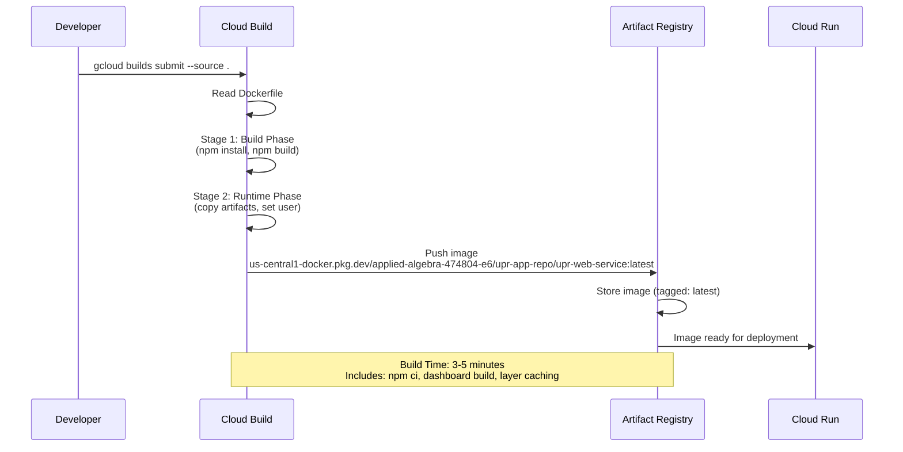
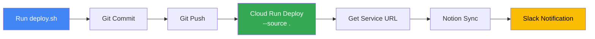
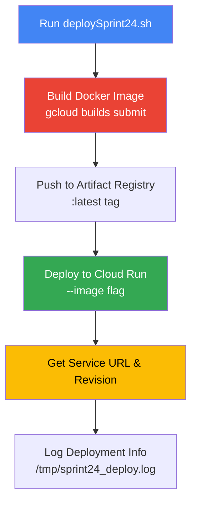
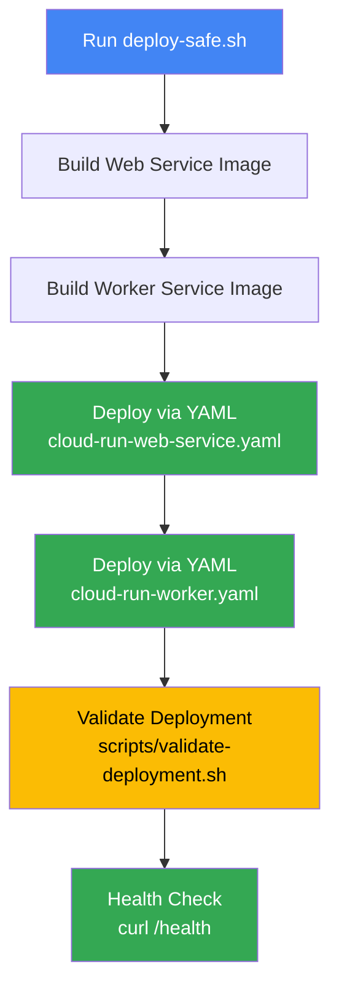
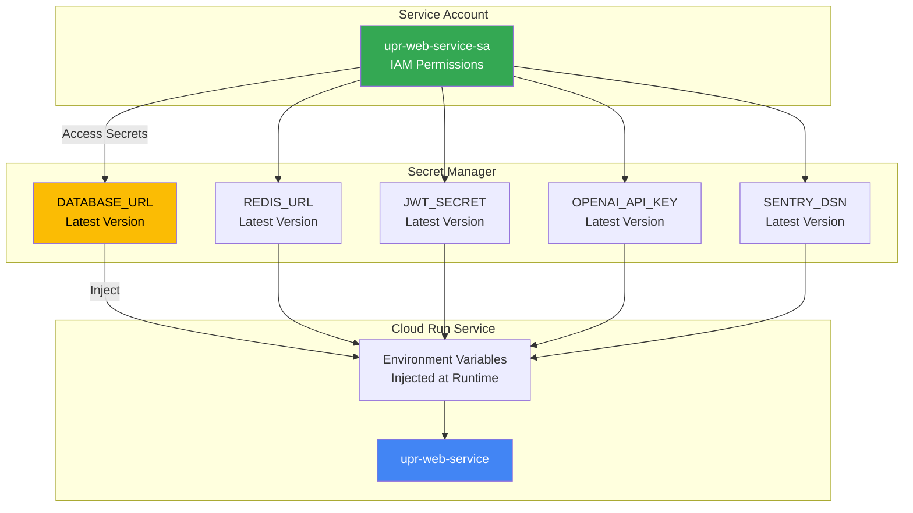

# Deployment Pipeline Documentation

**Status**: ✅ COMPLETE
**Completion Date**: November 16, 2025
**Sprint**: Sprint 26
**Phase**: Phase 4 Infrastructure

---

## Overview

This document provides comprehensive documentation of the UPR SIVA AI platform deployment pipeline, covering CI/CD workflows, Cloud Build integration, deployment procedures, rollback mechanisms, and production validation.

### Key Components

1. **Cloud Build**: Automated Docker image building
2. **Cloud Run**: Serverless deployment platform
3. **Deployment Scripts**: Automated deployment workflows
4. **Rollback Procedures**: Quick revert to previous revisions
5. **Testing Gates**: Smoke tests and validation checks

---

## 1. CI/CD Pipeline Architecture

### High-Level Pipeline Flow

```mermaid
graph TB
    subgraph "Development"
        DEV[Developer<br/>Local Machine]
        GIT[Git Repository<br/>GitHub/GitLab]
    end

    subgraph "Build Phase - Google Cloud Build"
        TRIGGER[Build Trigger<br/>Manual or Automated]
        DOCKERFILE[Dockerfile<br/>Multi-stage Build]
        BUILD[Cloud Build<br/>Build Container]
        TEST[Run Tests<br/>Optional Pre-Deploy]
        AR[Artifact Registry<br/>Store Image]
    end

    subgraph "Deploy Phase - Cloud Run"
        DEPLOY[Deploy to Cloud Run<br/>Update Revision]
        ROUTE[Traffic Routing<br/>0% → 100%]
        HEALTH[Health Checks<br/>/health, /ready]
    end

    subgraph "Validation Phase"
        SMOKE[Smoke Tests<br/>4 SIVA Tools]
        STRESS[Stress Tests<br/>200 req, 10 concurrency]
        MONITOR[Monitor Errors<br/>Sentry + Cloud Logging]
    end

    subgraph "Post-Deployment"
        NOTION[Notion Sync<br/>Update Status]
        SLACK[Slack Notification<br/>Deployment Alert]
        PROD[Production<br/>100% Traffic]
    end

    DEV -->|git push| GIT
    GIT -->|Trigger| TRIGGER
    TRIGGER --> DOCKERFILE
    DOCKERFILE --> BUILD
    BUILD -->|Success| TEST
    TEST -->|Pass| AR
    AR -->|Image Ready| DEPLOY
    DEPLOY --> ROUTE
    ROUTE --> HEALTH
    HEALTH -->|Pass| SMOKE
    SMOKE -->|Pass| STRESS
    STRESS -->|Pass| MONITOR
    MONITOR -->|No Errors| NOTION
    NOTION --> SLACK
    SLACK --> PROD

    style BUILD fill:#4285F4,color:#fff
    style DEPLOY fill:#34A853,color:#fff
    style SMOKE fill:#FBBC04,color:#000
    style PROD fill:#34A853,color:#fff
```



### Pipeline Stages

| Stage | Duration | Description | Failure Action |
|-------|----------|-------------|----------------|
| **1. Git Push** | ~5s | Developer pushes code to repository | N/A |
| **2. Cloud Build Trigger** | ~10s | Build job initiated (manual or automated) | N/A |
| **3. Docker Build** | ~3-5min | Multi-stage build (build + runtime layers) | Rollback to previous image |
| **4. Artifact Push** | ~30s | Push image to Artifact Registry | Retry build |
| **5. Cloud Run Deploy** | ~1-2min | Deploy new revision, update service | Rollback to previous revision |
| **6. Health Checks** | ~30s | Verify /health and /ready endpoints | Rollback immediately |
| **7. Smoke Tests** | ~1min | Test all 4 SIVA tools | Rollback and investigate |
| **8. Stress Tests** | ~2min | 200 requests, 10 concurrent | Monitor (non-blocking) |
| **9. Monitoring** | Ongoing | Sentry error tracking, Cloud Logging | Alert on threshold |

**Total Pipeline Duration**: ~8-12 minutes (from git push to 100% traffic)

---

## 2. Cloud Build Configuration

### Build Process



### Docker Build Stages

**Stage 1: Build Phase**
```dockerfile
FROM node:20-alpine AS build

WORKDIR /app
COPY package*.json ./
RUN npm ci || npm install --only=production
COPY . .

# Build dashboard
WORKDIR /app/dashboard
RUN npm ci || npm install --no-audit --no-fund
RUN npm run build
```

**Stage 2: Runtime Phase**
```dockerfile
FROM node:20-alpine AS runtime

WORKDIR /app
RUN apk add --no-cache dumb-init

# Copy artifacts from build stage
COPY --from=build /app/package*.json ./
COPY --from=build /app/node_modules ./node_modules
COPY --from=build /app/server.js ./server.js
COPY --from=build /app/instrument.js ./instrument.js
COPY --from=build /app/routes ./routes
COPY --from=build /app/server ./server
COPY --from=build /app/dashboard/dist ./dashboard/dist

# Security: Run as non-root user
RUN addgroup -g 1001 -S nodejs && adduser -S nodejs -u 1001
RUN chown -R nodejs:nodejs /app
USER nodejs

EXPOSE 8080
ENV NODE_ENV=production
ENV PORT=8080

ENTRYPOINT ["dumb-init", "--"]
CMD ["node", "server.js"]
```

### Build Commands

**Manual Build (Source-based)**:
```bash
gcloud builds submit \
  --source . \
  --region us-central1 \
  --timeout=20m
```

**Manual Build (Image-based)**:
```bash
gcloud builds submit \
  --tag us-central1-docker.pkg.dev/applied-algebra-474804-e6/upr-app-repo/upr-web-service:latest \
  --timeout=20m
```

**Check Build Status**:
```bash
# List recent builds
gcloud builds list --limit=5

# View specific build
gcloud builds describe BUILD_ID

# Stream build logs
gcloud builds log BUILD_ID --stream
```

---

## 3. Deployment Workflows

### Deployment Option 1: Quick Deploy (Automated)

**Script**: `scripts/deploy.sh`

**Usage**:
```bash
./scripts/deploy.sh "feat(sprint-26): Add feedback loop API" [service-name]
```

**Workflow**:


**Features**:
- Automatic git commit & push
- Direct source-to-Cloud Run deployment (no explicit build step)
- Notion sync integration
- Slack notifications (if `SLACK_WEBHOOK_URL` configured)

**Best For**: Rapid iteration, feature development, minor updates

---

### Deployment Option 2: Controlled Deploy (Sprint-based)

**Script**: `scripts/sprint24/deploySprint24.sh` (pattern for all sprints)

**Usage**:
```bash
./scripts/sprint24/deploySprint24.sh
```

**Workflow**:


**Features**:
- Explicit build step (reproducible images)
- Deployment logging (`/tmp/sprint*_build.log`, `/tmp/sprint*_deploy.log`)
- Revision tracking
- Next steps guidance

**Best For**: Sprint completions, production releases, auditable deployments

---

### Deployment Option 3: Safe Deploy (Declarative)

**Script**: `deploy-safe.sh`

**Usage**:
```bash
./deploy-safe.sh
```

**Workflow**:


**Features**:
- Declarative configuration (YAML files)
- Multi-service deployment (web + worker)
- Built-in validation
- Health check verification

**Best For**: Infrastructure-as-code, multi-service updates, configuration changes

---

## 4. Rollback Procedures

### Quick Rollback (Traffic Splitting)

**Scenario**: New revision has issues, need immediate rollback

**Method 1: Traffic Rollback (Zero Downtime)**

```bash
# Step 1: List recent revisions
gcloud run revisions list \
  --service=upr-web-service \
  --region=us-central1 \
  --limit=5

# Output example:
# NAME                         SERVICE           TRAFFIC  DEPLOYED
# upr-web-service-00392-fmr    upr-web-service   100      2025-11-15
# upr-web-service-00391-q6q    upr-web-service   0        2025-11-14
# upr-web-service-00390-abc    upr-web-service   0        2025-11-13

# Step 2: Route 100% traffic to previous revision
gcloud run services update-traffic upr-web-service \
  --region=us-central1 \
  --to-revisions=upr-web-service-00391-q6q=100

# Step 3: Verify traffic routing
gcloud run services describe upr-web-service \
  --region=us-central1 \
  --format="value(status.traffic)"

# Expected: upr-web-service-00391-q6q,100
```

**Duration**: ~30 seconds
**Downtime**: Zero (gradual traffic shift)

---

### Method 2: Gradual Rollback (Canary)

**Scenario**: Uncertain if rollback needed, test previous revision first

```bash
# Step 1: Split traffic 90% old, 10% new (test waters)
gcloud run services update-traffic upr-web-service \
  --region=us-central1 \
  --to-revisions=upr-web-service-00391-q6q=90,upr-web-service-00392-fmr=10

# Step 2: Monitor error rates in Sentry (5-10 minutes)

# Step 3a: If old revision stable, rollback fully
gcloud run services update-traffic upr-web-service \
  --region=us-central1 \
  --to-revisions=upr-web-service-00391-q6q=100

# Step 3b: If new revision fixed, restore
gcloud run services update-traffic upr-web-service \
  --region=us-central1 \
  --to-latest
```

**Duration**: ~5-10 minutes (includes monitoring)
**Downtime**: Zero

---

### Method 3: Full Rollback (Re-deploy)

**Scenario**: Previous revision deleted, need to re-deploy from image

```bash
# Step 1: Find previous image in Artifact Registry
gcloud artifacts docker images list \
  us-central1-docker.pkg.dev/applied-algebra-474804-e6/upr-app-repo/upr-web-service \
  --limit=10

# Step 2: Deploy specific image
gcloud run deploy upr-web-service \
  --region=us-central1 \
  --image=us-central1-docker.pkg.dev/applied-algebra-474804-e6/upr-app-repo/upr-web-service@sha256:DIGEST \
  --platform=managed

# Step 3: Verify deployment
gcloud run services describe upr-web-service \
  --region=us-central1 \
  --format="value(status.latestReadyRevisionName)"
```

**Duration**: ~2-3 minutes
**Downtime**: Minimal (~30 seconds during revision switch)

---

### Rollback Decision Matrix

| Severity | Symptoms | Rollback Method | Timeline |
|----------|----------|-----------------|----------|
| **Critical** | 50%+ error rate, service down | Traffic Rollback (100%) | Immediate (30s) |
| **High** | 10-50% error rate, data corruption | Traffic Rollback (100%) | <5 minutes |
| **Medium** | 5-10% error rate, performance degradation | Gradual Rollback (Canary) | 5-10 minutes |
| **Low** | <5% error rate, minor issues | Monitor + Fix Forward | 1-2 hours |
| **Cosmetic** | UI glitches, non-critical features | Fix Forward | Next deployment |

---

## 5. Environment Management

### Secret Management (Google Secret Manager)



### Managing Secrets

**List Secrets**:
```bash
gcloud secrets list --project=applied-algebra-474804-e6
```

**View Secret Versions**:
```bash
gcloud secrets versions list DATABASE_URL
```

**Update Secret** (Zero Downtime):
```bash
# Add new version
echo -n "postgresql://new_connection_string" | \
  gcloud secrets versions add DATABASE_URL --data-file=-

# Cloud Run automatically picks up "latest" version on next deploy
# OR force update without redeploy:
gcloud run services update upr-web-service \
  --region=us-central1 \
  --update-secrets=DATABASE_URL=DATABASE_URL:latest
```

**Disable Secret Version** (Rollback):
```bash
gcloud secrets versions disable VERSION_NUMBER --secret=DATABASE_URL
```

---

### Environment Variables

**Current Configuration** (Cloud Run):

| Variable | Source | Description |
|----------|--------|-------------|
| `NODE_ENV` | Direct | Set to `production` |
| `PORT` | Direct | Set to `8080` |
| `DATABASE_URL` | Secret Manager | PostgreSQL connection string |
| `REDIS_URL` | Secret Manager | Redis connection string |
| `JWT_SECRET` | Secret Manager | Authentication secret |
| `APOLLO_API_KEY` | Secret Manager | External API key |
| `SERPAPI_KEY` | Secret Manager | External API key |
| `OPENAI_API_KEY` | Secret Manager | OpenAI API key |
| `NEVERBOUNCE_API_KEY` | Secret Manager | Email validation API key |
| `TENANT_ID` | Secret Manager | Multi-tenancy identifier |
| `SENTRY_DSN` | Hardcoded (instrument.js) | Sentry error tracking DSN |

---

## 6. Testing Gates

### Pre-Deploy Testing (Local)

```bash
# Run linter
npm run lint

# Run unit tests
npm test

# Run integration tests
npm run test:integration

# Build dashboard
cd dashboard && npm run build
```

---

### Post-Deploy Validation (Production)

**Smoke Test (Required)**: Tests all 4 SIVA tools

```bash
API_URL="https://upr-web-service-191599223867.us-central1.run.app" \
  node scripts/testing/smokeTestSprint25.js
```

**Expected Output**:
```
✅ CompanyQuality Tool: PASS (7ms)
✅ ContactTier Tool: PASS (1ms)
✅ TimingScore Tool: PASS (5ms)
✅ BankingProductMatch Tool: PASS (3ms)

Result: 4/4 tests passed (100%)
```

**Stress Test (Recommended)**: 200 requests, 10 concurrent

```bash
API_URL="https://upr-web-service-191599223867.us-central1.run.app" \
  CONCURRENCY=10 \
  ITERATIONS=50 \
  node scripts/testing/stressTestSprint23.js
```

**Expected Output**:
```
Total Requests: 200
Success: 199 (99.5%)
Failures: 1 (0.5%)
Avg Latency: 45ms
P95 Latency: 120ms
P99 Latency: 250ms
```

---

### Health Check Endpoints

**Basic Health** (`/health`):
```bash
curl https://upr-web-service-191599223867.us-central1.run.app/health
```

**Response**:
```json
{
  "status": "ok",
  "timestamp": "2025-11-16T10:30:00.000Z",
  "uptime": 86400,
  "port": 8080
}
```

**Database Readiness** (`/ready`):
```bash
curl https://upr-web-service-191599223867.us-central1.run.app/ready
```

**Response**:
```json
{
  "status": "ready",
  "database": "connected"
}
```

---

## 7. Monitoring & Validation

### Post-Deployment Monitoring Checklist

**Immediate (0-5 minutes)**:
- [ ] Health check passes (`/health` returns 200)
- [ ] Database readiness passes (`/ready` returns 200)
- [ ] Smoke test passes (4/4 tools operational)
- [ ] No 5xx errors in Cloud Logging
- [ ] No critical errors in Sentry

**Short-term (5-30 minutes)**:
- [ ] Stress test passes (99%+ success rate)
- [ ] Average latency < 100ms (P95 < 500ms)
- [ ] No memory leaks (container memory stable)
- [ ] No database connection pool exhaustion
- [ ] Shadow mode logging working (decisions logged)

**Medium-term (30 minutes - 2 hours)**:
- [ ] Error rate < 1% (Sentry dashboard)
- [ ] No user-reported issues
- [ ] Performance within SLA (99.5% uptime)
- [ ] Database queries optimized (no slow queries)

**Long-term (2-24 hours)**:
- [ ] Notion updated (deployment notes)
- [ ] Documentation updated (if API changes)
- [ ] Git tagged (if major release)
- [ ] Stakeholders notified

---

### Monitoring Tools

**Sentry** (Error Tracking):
```
https://sentry.io/organizations/o4510313810624512/issues/
Project: 4510313907159040
Environment: production
```

**Cloud Logging** (Request Logs):
```bash
gcloud logging read \
  "resource.type=cloud_run_revision AND resource.labels.service_name=upr-web-service" \
  --limit=50 \
  --format=json
```

**Cloud Monitoring** (Metrics):
```bash
# Request count
gcloud monitoring time-series list \
  --filter='metric.type="run.googleapis.com/request_count"'

# Latency
gcloud monitoring time-series list \
  --filter='metric.type="run.googleapis.com/request_latencies"'
```

---

## 8. Deployment Checklists

### Sprint Deployment Checklist

**Pre-Deployment**:
- [ ] All tests passing locally
- [ ] Git branch up to date with main
- [ ] No uncommitted changes
- [ ] Environment secrets verified
- [ ] Database migrations tested (if applicable)

**Deployment**:
- [ ] Run deployment script (`./scripts/deploy.sh` or sprint-specific)
- [ ] Monitor build logs (no errors)
- [ ] Wait for deployment completion (~5-10 minutes)
- [ ] Record revision number

**Post-Deployment**:
- [ ] Smoke test passes (4/4 tools)
- [ ] Stress test passes (99%+ success)
- [ ] Health checks passing
- [ ] No Sentry errors (first 5 minutes)
- [ ] Update Notion (sprint status, features marked complete)
- [ ] Create completion report (docs/SPRINT_XX_COMPLETION.md)
- [ ] Git commit completion docs
- [ ] Tag release (if major version)

---

### Hotfix Deployment Checklist

**Pre-Deployment**:
- [ ] Severity assessed (critical/high/medium)
- [ ] Root cause identified
- [ ] Fix verified locally
- [ ] Rollback plan documented

**Deployment**:
- [ ] Create hotfix branch (`hotfix/issue-description`)
- [ ] Deploy to production
- [ ] Monitor error rates (Sentry)
- [ ] Smoke test immediately

**Post-Deployment**:
- [ ] Verify fix resolves issue
- [ ] Monitor for 30 minutes
- [ ] Merge hotfix to main
- [ ] Document in postmortem (if needed)

---

## 9. Common Deployment Scenarios

### Scenario 1: Normal Sprint Completion

```bash
# 1. Complete sprint work (all tests passing)
# 2. Git commit all changes
git add .
git commit -m "feat(sprint-26): Complete Phase 4 topology diagrams + Phase 10 feedback loop"

# 3. Deploy using sprint script
./scripts/deploy.sh "feat(sprint-26): Complete Phase 4 topology diagrams + Phase 10 feedback loop"

# 4. Wait for deployment (~5-10 minutes)
# 5. Run smoke test
API_URL="https://upr-web-service-191599223867.us-central1.run.app" \
  node scripts/testing/smokeTestSprint25.js

# 6. Update Notion
node scripts/notion/completeSprint26.js

# 7. Create completion report
# (docs/SPRINT_26_COMPLETION.md)
```

---

### Scenario 2: Emergency Rollback

```bash
# 1. Identify issue (error spike in Sentry)
# 2. List recent revisions
gcloud run revisions list --service=upr-web-service --region=us-central1 --limit=5

# 3. Rollback to previous revision (30 seconds)
gcloud run services update-traffic upr-web-service \
  --region=us-central1 \
  --to-revisions=upr-web-service-00391-q6q=100

# 4. Verify rollback
curl https://upr-web-service-191599223867.us-central1.run.app/health

# 5. Monitor Sentry (errors should stop)
# 6. Investigate root cause offline
# 7. Fix and redeploy when ready
```

---

### Scenario 3: Database Migration Deployment

```bash
# 1. Test migration locally
PGPASSWORD='...' psql -h localhost -U postgres -d upr_test -f db/migrations/XXX.sql

# 2. Run migration on production database
PGPASSWORD='...' psql \
  -h 34.121.0.240 \
  -U upr_app \
  -d upr_production \
  -f db/migrations/XXX.sql

# 3. Verify migration
PGPASSWORD='...' psql -h 34.121.0.240 -U upr_app -d upr_production -c "\dt agent_core.*"

# 4. Deploy application code (depends on migration)
./scripts/deploy.sh "feat: Add new schema for feedback loop"

# 5. Verify application uses new schema
API_URL="https://upr-web-service-191599223867.us-central1.run.app" \
  node scripts/testing/smokeTestSprint26.js
```

---

### Scenario 4: Multi-Service Deployment

```bash
# 1. Build both images
gcloud builds submit --tag us-central1-docker.pkg.dev/.../upr-web-service:latest
gcloud builds submit --tag us-central1-docker.pkg.dev/.../upr-enrichment-worker:latest

# 2. Deploy using safe script (YAML-based)
./deploy-safe.sh

# 3. Validate both services
curl https://upr.sivakumar.ai/health
# (worker health check endpoint)

# 4. Monitor both services in Sentry
```

---

## 10. Troubleshooting

### Build Failures

**Symptom**: `gcloud builds submit` fails

**Common Causes**:
1. Dockerfile syntax error
2. npm install fails (dependency conflict)
3. Dashboard build fails (React build error)
4. Timeout (>20 minutes)

**Resolution**:
```bash
# View build logs
gcloud builds log BUILD_ID --stream

# Common fixes:
# - npm ci --legacy-peer-deps (dependency conflicts)
# - Increase timeout: --timeout=30m
# - Clear npm cache: RUN npm cache clean --force
```

---

### Deployment Failures

**Symptom**: `gcloud run deploy` fails

**Common Causes**:
1. Invalid image reference
2. Insufficient IAM permissions
3. VPC connector unreachable
4. Health check failing

**Resolution**:
```bash
# Check service status
gcloud run services describe upr-web-service --region=us-central1

# View deployment logs
gcloud logging read \
  "resource.type=cloud_run_revision AND severity>=ERROR" \
  --limit=20

# Common fixes:
# - Verify image exists: gcloud artifacts docker images list ...
# - Check IAM: gcloud projects get-iam-policy PROJECT_ID
# - Test health check: docker run -p 8080:8080 IMAGE_NAME
```

---

### Traffic Routing Issues

**Symptom**: New revision deployed but not receiving traffic

**Resolution**:
```bash
# Check traffic routing
gcloud run services describe upr-web-service \
  --region=us-central1 \
  --format="value(status.traffic)"

# Force traffic to latest
gcloud run services update-traffic upr-web-service \
  --region=us-central1 \
  --to-latest
```

---

## Completion Notes

**Sprint 26 Deployment Pipeline Documentation**:
- ✅ CI/CD pipeline architecture documented
- ✅ Cloud Build process documented (multi-stage Docker build)
- ✅ 3 deployment workflows documented (quick, controlled, safe)
- ✅ Rollback procedures documented (3 methods)
- ✅ Environment management documented (Secret Manager)
- ✅ Testing gates documented (smoke, stress, health checks)
- ✅ Monitoring & validation documented (Sentry, Cloud Logging)
- ✅ Deployment checklists documented (sprint, hotfix)
- ✅ Common scenarios documented (normal, rollback, migration, multi-service)
- ✅ Troubleshooting guide documented

**Next Steps**:
- Create disaster recovery plan (backup, RTO, database restore)
- Build Phase 10 feedback loop foundation

---

*Generated: 2025-11-16 | Sprint 26 | Phase 4 Infrastructure*
