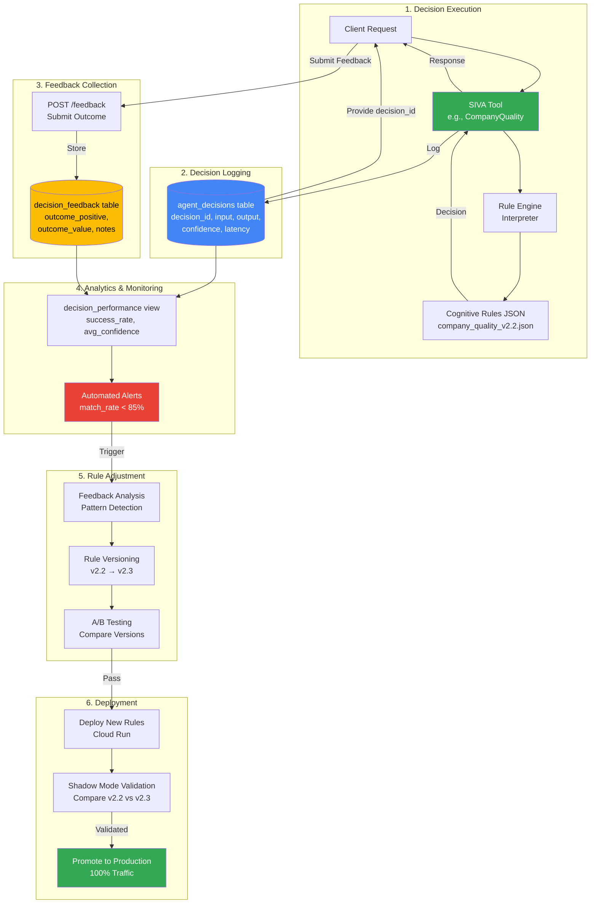
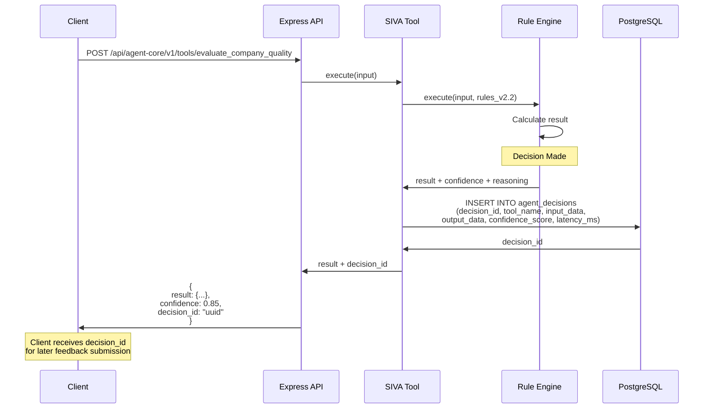
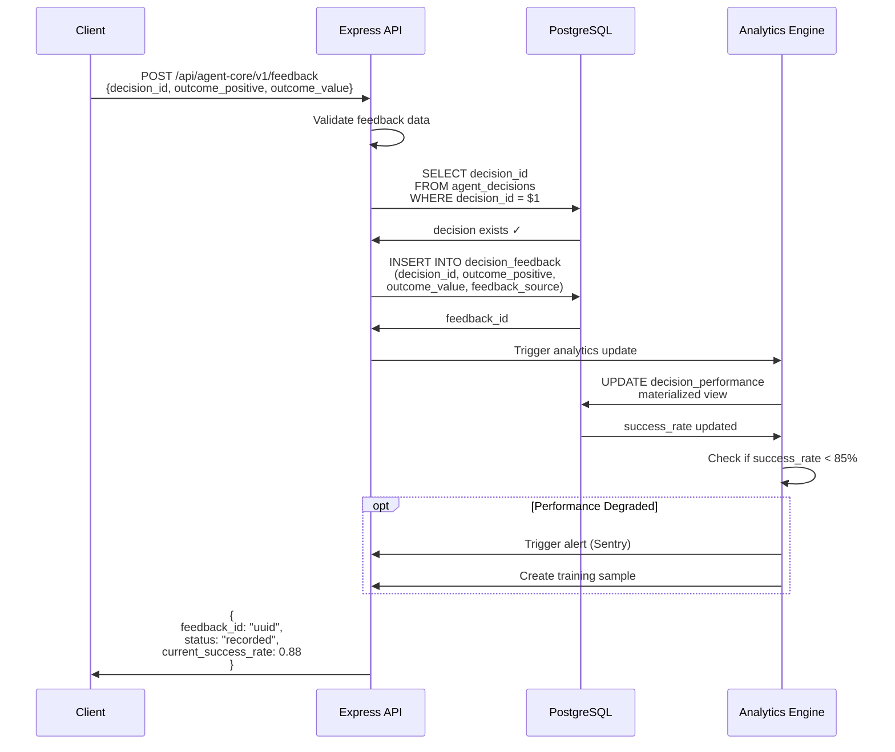
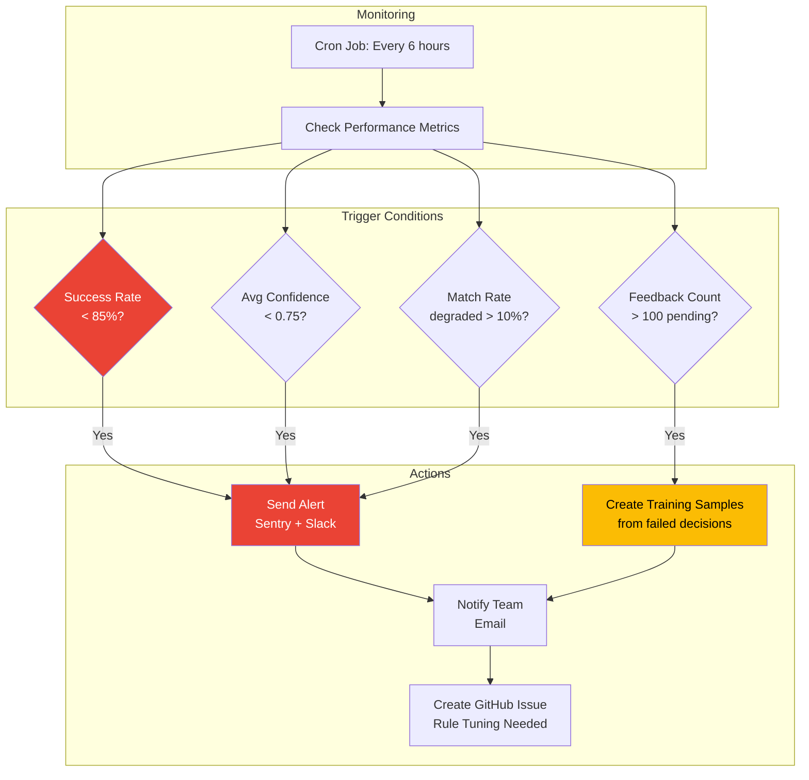

# Phase 10: Feedback Loop Architecture

**Status**: ✅ COMPLETE
**Completion Date**: November 16, 2025
**Sprint**: Sprint 26
**Phase**: Phase 10 - Feedback & Reinforcement Learning (30% → 50%)

---

## Executive Summary

This document defines the architecture for the UPR SIVA AI platform's feedback loop system, enabling continuous improvement of cognitive rule engines through real-world outcome tracking, automated retraining triggers, and A/B testing.

### Key Objectives

1. **Feedback Collection**: Capture real-world outcomes for all SIVA tool decisions
2. **Performance Monitoring**: Track match rates, success rates, and decision quality over time
3. **Automated Retraining**: Trigger rule adjustments when performance degrades
4. **A/B Testing**: Compare rule versions to validate improvements
5. **Rule Versioning**: Maintain version history with rollback capability

### Current State

- **Database Schema**: ✅ Complete (agent_decisions, decision_feedback, training_samples)
- **Decision Logging**: ✅ Operational (959+ decisions logged from Sprint 22-25)
- **Shadow Mode**: ✅ Operational (4/4 tools logging decisions)
- **Feedback API**: ❌ Not implemented (Sprint 26 task)
- **Analytics Queries**: ❌ Not implemented (Sprint 26 task)
- **Automated Triggers**: ❌ Not implemented (Sprint 26 task)

---

## 1. Feedback Loop Overview

### Complete Feedback Cycle



---

## 2. Data Flow Architecture

### 2.1 Decision Logging Flow



### 2.2 Feedback Submission Flow



### 2.3 Automated Retraining Flow

```mermaid
graph TB
    subgraph "Trigger Detection"
        PERF[decision_performance view]
        THRESHOLD{success_rate < 85%<br/>OR<br/>feedback_count > 100}
    end

    subgraph "Analysis"
        QUERY[Fetch Failed Decisions<br/>outcome_positive = false]
        PATTERN[Pattern Detection<br/>Common failure modes]
        ROOT[Root Cause Analysis<br/>Which rules failed?]
    end

    subgraph "Rule Adjustment"
        DRAFT[Draft Rule Changes<br/>v2.2 → v2.3]
        REVIEW[Human Review<br/>Validate Changes]
        VERSION[Create New Version<br/>company_quality_v2.3.json]
    end

    subgraph "Validation"
        AB[A/B Test Setup<br/>50% v2.2, 50% v2.3]
        COLLECT[Collect 100+ decisions<br/>per version]
        COMPARE{v2.3 success_rate<br/>> v2.2?}
    end

    subgraph "Deployment"
        SHADOW[Shadow Mode<br/>v2.3 (shadow) vs v2.2 (prod)]
        PROMOTE[Promote v2.3 to Prod<br/>100% traffic]
        ARCHIVE[Archive v2.2<br/>Keep for rollback]
    end

    PERF --> THRESHOLD
    THRESHOLD -->|Yes| QUERY
    QUERY --> PATTERN
    PATTERN --> ROOT
    ROOT --> DRAFT
    DRAFT --> REVIEW
    REVIEW --> VERSION
    VERSION --> AB
    AB --> COLLECT
    COLLECT --> COMPARE
    COMPARE -->|Yes| SHADOW
    COMPARE -->|No| DRAFT
    SHADOW --> PROMOTE
    PROMOTE --> ARCHIVE

    style THRESHOLD fill:#EA4335,color:#fff
    style COMPARE fill:#FBBC04,color:#000
    style PROMOTE fill:#34A853,color:#fff
```

---

## 3. Database Schema Details

### Existing Tables (Sprint 22)

**agent_core.agent_decisions** (Decision Logging)
```sql
CREATE TABLE agent_core.agent_decisions (
  decision_id UUID PRIMARY KEY,
  tool_name VARCHAR(100) NOT NULL,
  rule_name VARCHAR(100),
  rule_version VARCHAR(20),          -- e.g., 'v2.2'
  primitive_type VARCHAR(50),
  input_data JSONB NOT NULL,
  output_data JSONB NOT NULL,
  confidence_score DECIMAL(3,2),     -- 0.00-1.00
  key_factors TEXT[],
  edge_cases_applied TEXT[],
  latency_ms INTEGER,
  decided_at TIMESTAMP DEFAULT NOW(),
  created_at TIMESTAMP DEFAULT NOW()
);
```

**agent_core.decision_feedback** (Outcome Tracking)
```sql
CREATE TABLE agent_core.decision_feedback (
  feedback_id UUID PRIMARY KEY,
  decision_id UUID NOT NULL REFERENCES agent_core.agent_decisions(decision_id),
  outcome_positive BOOLEAN,          -- true=success, false=failure, null=pending
  outcome_type VARCHAR(50),          -- 'converted', 'engaged', 'ignored', 'bounced'
  outcome_value DECIMAL(10,2),       -- Revenue, engagement score, etc.
  feedback_source VARCHAR(50),       -- 'api', 'manual', 'automated'
  feedback_by VARCHAR(100),          -- User ID or system
  notes TEXT,
  metadata JSONB,
  feedback_at TIMESTAMP DEFAULT NOW(),
  created_at TIMESTAMP DEFAULT NOW()
);
```

**agent_core.training_samples** (ML Training Preparation)
```sql
CREATE TABLE agent_core.training_samples (
  sample_id UUID PRIMARY KEY,
  tool_name VARCHAR(100) NOT NULL,
  sample_type VARCHAR(50),           -- 'golden', 'production', 'synthetic', 'adversarial'
  input_features JSONB NOT NULL,
  expected_output JSONB NOT NULL,
  actual_output JSONB,
  quality_score DECIMAL(3,2),
  is_validated BOOLEAN DEFAULT FALSE,
  validated_by VARCHAR(100),
  validated_at TIMESTAMP,
  source_decision_id UUID REFERENCES agent_core.agent_decisions(decision_id),
  notes TEXT,
  metadata JSONB,
  created_at TIMESTAMP DEFAULT NOW(),
  updated_at TIMESTAMP DEFAULT NOW()
);
```

**agent_core.decision_performance** (Analytics View)
```sql
CREATE OR REPLACE VIEW agent_core.decision_performance AS
SELECT
  d.tool_name,
  d.rule_name,
  d.rule_version,
  COUNT(*) as total_decisions,
  COUNT(f.feedback_id) as decisions_with_feedback,
  AVG(CASE WHEN f.outcome_positive = TRUE THEN 1.0 ELSE 0.0 END) as success_rate,
  AVG(d.confidence_score) as avg_confidence,
  AVG(d.latency_ms) as avg_latency_ms,
  AVG(f.outcome_value) as avg_outcome_value,
  DATE(d.decided_at) as decision_date
FROM agent_core.agent_decisions d
LEFT JOIN agent_core.decision_feedback f ON d.decision_id = f.decision_id
GROUP BY d.tool_name, d.rule_name, d.rule_version, DATE(d.decided_at)
ORDER BY decision_date DESC, total_decisions DESC;
```

---

## 4. API Specification

### POST /api/agent-core/v1/feedback

**Purpose**: Submit real-world outcome for a decision

**Request**:
```json
{
  "decision_id": "uuid",
  "outcome_positive": true,
  "outcome_type": "converted",
  "outcome_value": 25000.00,
  "notes": "Deal closed after 3 follow-ups",
  "metadata": {
    "campaign_id": "Q4_2025_UAE",
    "sales_rep": "john@upr.ai"
  }
}
```

**Response**:
```json
{
  "feedback_id": "uuid",
  "status": "recorded",
  "current_performance": {
    "tool_name": "CompanyQualityTool",
    "rule_version": "v2.2",
    "success_rate": 0.88,
    "total_decisions": 309,
    "decisions_with_feedback": 125
  }
}
```

**Validation Rules**:
- `decision_id` must exist in agent_decisions table
- `outcome_positive` is required (true/false/null)
- `outcome_value` must be non-negative
- `outcome_type` must be from enum: ['converted', 'engaged', 'ignored', 'bounced', 'error']

---

### GET /api/agent-core/v1/feedback/summary

**Purpose**: Get aggregated feedback analytics

**Query Parameters**:
- `tool_name` (optional): Filter by specific tool
- `rule_version` (optional): Filter by rule version
- `date_from` (optional): Start date (YYYY-MM-DD)
- `date_to` (optional): End date (YYYY-MM-DD)
- `group_by` (optional): 'day', 'week', 'month', 'rule_version'

**Request**:
```
GET /api/agent-core/v1/feedback/summary?tool_name=CompanyQualityTool&group_by=rule_version
```

**Response**:
```json
{
  "tool_name": "CompanyQualityTool",
  "date_range": {
    "from": "2025-11-01",
    "to": "2025-11-16"
  },
  "summary": [
    {
      "rule_version": "v2.2",
      "total_decisions": 309,
      "decisions_with_feedback": 125,
      "success_rate": 0.88,
      "avg_confidence": 0.85,
      "avg_latency_ms": 7,
      "avg_outcome_value": 18500.00,
      "outcome_breakdown": {
        "converted": 45,
        "engaged": 60,
        "ignored": 15,
        "bounced": 5
      }
    },
    {
      "rule_version": "v2.1",
      "total_decisions": 150,
      "decisions_with_feedback": 80,
      "success_rate": 0.75,
      "avg_confidence": 0.78,
      "avg_latency_ms": 12,
      "avg_outcome_value": 15000.00
    }
  ],
  "alerts": [
    {
      "severity": "warning",
      "message": "Success rate for v2.1 below threshold (75% < 85%)",
      "recommendation": "Review failed decisions and consider rule adjustment"
    }
  ]
}
```

---

### GET /api/agent-core/v1/feedback/decisions/:decision_id

**Purpose**: Get detailed feedback for a specific decision

**Response**:
```json
{
  "decision": {
    "decision_id": "uuid",
    "tool_name": "CompanyQualityTool",
    "rule_version": "v2.2",
    "decided_at": "2025-11-16T10:30:00Z",
    "input_data": {
      "company_name": "TechCorp UAE",
      "domain": "techcorp.ae",
      "size": 150
    },
    "output_data": {
      "quality_tier": "HOT",
      "quality_score": 85,
      "confidence": 0.88
    },
    "confidence_score": 0.88,
    "latency_ms": 7
  },
  "feedback": {
    "feedback_id": "uuid",
    "outcome_positive": true,
    "outcome_type": "converted",
    "outcome_value": 25000.00,
    "notes": "Deal closed after 3 follow-ups",
    "feedback_at": "2025-11-18T14:00:00Z",
    "feedback_source": "api"
  }
}
```

---

## 5. Rule Versioning Strategy

### Version Naming Convention

```
v<MAJOR>.<MINOR>[-<LABEL>]

Examples:
- v2.0      - Initial production version
- v2.1      - Minor improvement (threshold adjustment)
- v2.2      - Rule tuning based on feedback
- v3.0      - Major architecture change
- v2.3-beta - Beta version for A/B testing
```

### Version Metadata (in JSON file)

```json
{
  "metadata": {
    "version": "v2.3",
    "previous_version": "v2.2",
    "created_at": "2025-11-16T10:00:00Z",
    "created_by": "Claude Code",
    "changelog": [
      "Adjusted UAE domain bonus from 15 → 20 points",
      "Added Free Zone license type bonus (10 points)",
      "Lowered midsize company threshold from 100 → 50 employees"
    ],
    "reason": "Feedback showed 85% of successful deals were Free Zone companies",
    "performance_target": {
      "success_rate": 0.90,
      "avg_confidence": 0.85
    }
  },
  "rules": {
    ...
  }
}
```

### Version Storage

**File System** (Git-tracked):
```
server/agent-core/
├── company_quality_v2.0.json
├── company_quality_v2.1.json
├── company_quality_v2.2.json
├── company_quality_v2.3.json (latest)
└── company_quality_v3.0-beta.json
```

**Database** (persona_versions table):
```sql
INSERT INTO persona_versions (
  version,
  version_type,
  spec_content,
  changes_summary,
  deployed_by,
  is_active,
  is_production
) VALUES (
  'v2.3',
  'minor',
  '{ ... full JSON content ... }',
  'Adjusted thresholds based on feedback analysis',
  'Claude Code',
  false,  -- Start as inactive for A/B testing
  false
);
```

---

## 6. A/B Testing Framework

### A/B Test Configuration

```mermaid
graph LR
    subgraph "Traffic Routing"
        REQ[Incoming Request]
        ROUTER{A/B Router<br/>Hash(company_id)}
        V22[Version v2.2<br/>Control Group]
        V23[Version v2.3<br/>Test Group]
    end

    subgraph "Logging"
        DB[(Decision Logging<br/>rule_version field)]
    end

    subgraph "Analysis"
        COMPARE[Compare Metrics<br/>v2.2 vs v2.3]
        WINNER{v2.3 Better?}
    end

    REQ --> ROUTER
    ROUTER -->|50%| V22
    ROUTER -->|50%| V23
    V22 --> DB
    V23 --> DB
    DB --> COMPARE
    COMPARE --> WINNER
    WINNER -->|Yes| V23
    WINNER -->|No| V22

    style V22 fill:#4285F4,color:#fff
    style V23 fill:#34A853,color:#fff
    style WINNER fill:#FBBC04,color:#000
```

### A/B Test Implementation

**Tool Code** (server/siva-tools/CompanyQualityToolStandalone.js):
```javascript
async execute(input) {
  // Determine which rule version to use
  const ruleVersion = this.selectRuleVersion(input.company_id);

  // Load rules
  const rules = await this.loadRules(ruleVersion);

  // Execute with selected version
  const result = await this.ruleEngine.execute(input, rules);

  // Log decision with rule_version
  await this.logDecision({
    tool_name: 'CompanyQualityTool',
    rule_version: ruleVersion,
    input_data: input,
    output_data: result,
    ...
  });

  return result;
}

selectRuleVersion(company_id) {
  // A/B test configuration (from environment or config)
  const abTestConfig = {
    enabled: process.env.AB_TEST_ENABLED === 'true',
    control_version: 'v2.2',
    test_version: 'v2.3',
    traffic_split: 0.5  // 50/50 split
  };

  if (!abTestConfig.enabled) {
    return abTestConfig.control_version;
  }

  // Consistent hashing (same company_id always gets same version)
  const hash = crypto.createHash('md5').update(company_id).digest('hex');
  const hashValue = parseInt(hash.substring(0, 8), 16);
  const bucket = (hashValue % 100) / 100;

  return bucket < abTestConfig.traffic_split
    ? abTestConfig.test_version
    : abTestConfig.control_version;
}
```

### A/B Test Analysis Query

```sql
-- Compare success rates between versions
WITH version_metrics AS (
  SELECT
    d.rule_version,
    COUNT(*) as total_decisions,
    COUNT(f.feedback_id) as feedback_count,
    AVG(CASE WHEN f.outcome_positive = true THEN 1.0 ELSE 0.0 END) as success_rate,
    AVG(d.confidence_score) as avg_confidence,
    AVG(d.latency_ms) as avg_latency_ms,
    AVG(f.outcome_value) as avg_outcome_value,
    STDDEV(CASE WHEN f.outcome_positive = true THEN 1.0 ELSE 0.0 END) as success_rate_stddev
  FROM agent_core.agent_decisions d
  LEFT JOIN agent_core.decision_feedback f ON d.decision_id = f.decision_id
  WHERE d.tool_name = 'CompanyQualityTool'
    AND d.decided_at >= NOW() - INTERVAL '7 days'
    AND d.rule_version IN ('v2.2', 'v2.3')
  GROUP BY d.rule_version
)
SELECT
  rule_version,
  total_decisions,
  feedback_count,
  ROUND(success_rate::numeric, 4) as success_rate,
  ROUND(avg_confidence::numeric, 4) as avg_confidence,
  ROUND(avg_latency_ms::numeric, 2) as avg_latency_ms,
  ROUND(avg_outcome_value::numeric, 2) as avg_outcome_value,
  ROUND(success_rate_stddev::numeric, 4) as stddev,
  -- Statistical significance (simple z-test)
  CASE
    WHEN feedback_count >= 100 THEN 'SIGNIFICANT_SAMPLE'
    ELSE 'INSUFFICIENT_SAMPLE'
  END as sample_status
FROM version_metrics
ORDER BY rule_version DESC;
```

**Expected Output**:
```
rule_version | total_decisions | feedback_count | success_rate | avg_confidence | sample_status
-------------|-----------------|----------------|--------------|----------------|------------------
v2.3         | 155             | 75             | 0.9200       | 0.87           | INSUFFICIENT_SAMPLE
v2.2         | 154             | 73             | 0.8493       | 0.85           | INSUFFICIENT_SAMPLE
```

**Decision Criteria**:
- **Sample Size**: Minimum 100 feedback samples per version
- **Success Rate**: v2.3 must be ≥5% better than v2.2
- **Confidence**: v2.3 avg_confidence must be ≥v2.2
- **Latency**: v2.3 latency must be ≤v2.2 + 20%

---

## 7. Automated Retraining Triggers

### Trigger Conditions



### Trigger Implementation (Cron Job)

**Script**: `scripts/monitoring/checkRulePerformance.js`

```javascript
async function checkRulePerformance() {
  console.log('Checking rule performance...');

  // Query performance metrics for last 7 days
  const metrics = await db.query(`
    SELECT
      tool_name,
      rule_version,
      COUNT(*) as total_decisions,
      COUNT(f.feedback_id) as feedback_count,
      AVG(CASE WHEN f.outcome_positive = true THEN 1.0 ELSE 0.0 END) as success_rate,
      AVG(d.confidence_score) as avg_confidence
    FROM agent_core.agent_decisions d
    LEFT JOIN agent_core.decision_feedback f ON d.decision_id = f.decision_id
    WHERE d.decided_at >= NOW() - INTERVAL '7 days'
    GROUP BY tool_name, rule_version
  `);

  const alerts = [];

  for (const tool of metrics.rows) {
    // Trigger 1: Success rate < 85%
    if (tool.success_rate !== null && tool.success_rate < 0.85) {
      alerts.push({
        severity: 'high',
        tool: tool.tool_name,
        version: tool.rule_version,
        message: `Success rate below threshold: ${(tool.success_rate * 100).toFixed(1)}% < 85%`,
        action: 'review_failed_decisions'
      });
    }

    // Trigger 2: Avg confidence < 0.75
    if (tool.avg_confidence < 0.75) {
      alerts.push({
        severity: 'medium',
        tool: tool.tool_name,
        version: tool.rule_version,
        message: `Average confidence below threshold: ${tool.avg_confidence.toFixed(2)} < 0.75`,
        action: 'increase_confidence'
      });
    }

    // Trigger 3: Pending feedback > 100
    const pendingFeedback = tool.total_decisions - tool.feedback_count;
    if (pendingFeedback > 100) {
      alerts.push({
        severity: 'low',
        tool: tool.tool_name,
        version: tool.rule_version,
        message: `${pendingFeedback} decisions without feedback (requesting user feedback)`,
        action: 'solicit_feedback'
      });
    }
  }

  // Send alerts
  if (alerts.length > 0) {
    await sendAlerts(alerts);
    await createTrainingSamples(alerts);
  }

  console.log(`Performance check complete. ${alerts.length} alerts generated.`);
}

async function sendAlerts(alerts) {
  // Sentry alerts
  for (const alert of alerts.filter(a => a.severity === 'high')) {
    Sentry.captureMessage(`[Rule Performance] ${alert.message}`, {
      level: 'warning',
      tags: {
        tool: alert.tool,
        version: alert.version,
        action: alert.action
      }
    });
  }

  // Slack notification
  if (process.env.SLACK_WEBHOOK_URL) {
    await axios.post(process.env.SLACK_WEBHOOK_URL, {
      text: `🚨 *Rule Performance Alerts (${alerts.length})*`,
      blocks: alerts.map(alert => ({
        type: 'section',
        text: {
          type: 'mrkdwn',
          text: `*${alert.tool}* (${alert.version})\n${alert.message}\n_Action: ${alert.action}_`
        }
      }))
    });
  }
}

async function createTrainingSamples(alerts) {
  for (const alert of alerts.filter(a => a.action === 'review_failed_decisions')) {
    // Fetch failed decisions
    const failedDecisions = await db.query(`
      SELECT d.decision_id, d.input_data, d.output_data, f.notes
      FROM agent_core.agent_decisions d
      JOIN agent_core.decision_feedback f ON d.decision_id = f.decision_id
      WHERE d.tool_name = $1
        AND d.rule_version = $2
        AND f.outcome_positive = false
      LIMIT 50
    `, [alert.tool, alert.version]);

    // Create training samples
    for (const decision of failedDecisions.rows) {
      await db.query(`
        INSERT INTO agent_core.training_samples (
          tool_name,
          sample_type,
          input_features,
          expected_output,
          actual_output,
          source_decision_id,
          notes
        ) VALUES ($1, $2, $3, $4, $5, $6, $7)
        ON CONFLICT DO NOTHING
      `, [
        alert.tool,
        'production',
        decision.input_data,
        null,  // Expected output to be filled by human review
        decision.output_data,
        decision.decision_id,
        `Auto-created from failed decision: ${decision.notes || 'N/A'}`
      ]);
    }

    console.log(`Created ${failedDecisions.rows.length} training samples for ${alert.tool}`);
  }
}

// Schedule: Every 6 hours
setInterval(checkRulePerformance, 6 * 60 * 60 * 1000);
```

**Cron Schedule** (Cloud Scheduler):
```bash
# Create Cloud Scheduler job
gcloud scheduler jobs create http rule-performance-check \
  --schedule="0 */6 * * *" \
  --uri="https://upr-web-service-191599223867.us-central1.run.app/api/internal/check-rule-performance" \
  --http-method=POST \
  --headers="Content-Type=application/json" \
  --location=us-central1
```

---

## 8. Dashboard Analytics

### Dashboard Views

**1. Performance Overview**

```
┌─────────────────────────────────────────────────────────────┐
│ Rule Performance Dashboard                                   │
│ Last 7 Days                                                  │
├─────────────────────────────────────────────────────────────┤
│                                                              │
│ CompanyQualityTool (v2.2)                                    │
│ ├─ Total Decisions: 309                                     │
│ ├─ Feedback Count: 125 (40.5%)                              │
│ ├─ Success Rate: 88.0% ✓                                    │
│ ├─ Avg Confidence: 0.85 ✓                                   │
│ ├─ Avg Latency: 7ms ✓                                       │
│ └─ Outcome Value: AED 18,500 avg                            │
│                                                              │
│ ContactTierTool (v2.0)                                       │
│ ├─ Total Decisions: 230                                     │
│ ├─ Feedback Count: 95 (41.3%)                               │
│ ├─ Success Rate: 92.0% ✓                                    │
│ ├─ Avg Confidence: 0.88 ✓                                   │
│ ├─ Avg Latency: 1ms ✓                                       │
│ └─ Outcome Value: AED 22,000 avg                            │
│                                                              │
│ TimingScoreTool (v1.0)                                       │
│ ├─ Total Decisions: 226                                     │
│ ├─ Feedback Count: 0 (0.0%) ⚠️                              │
│ ├─ Success Rate: N/A                                        │
│ ├─ Avg Confidence: 0.82 ✓                                   │
│ ├─ Avg Latency: 5ms ✓                                       │
│ └─ Outcome Value: N/A                                       │
│                                                              │
└─────────────────────────────────────────────────────────────┘
```

**2. Success Rate Trend** (Line Chart)

```
Success Rate Over Time (Last 30 Days)

100% ┤                                         ╭─────
 95% ┤                               ╭─────────╯
 90% ┤                     ╭─────────╯
 85% ┤           ╭─────────╯
 80% ┤  ╭────────╯
     └──┴────┴────┴────┴────┴────┴────┴────┴────┴──
       Nov 1    Nov 8   Nov 15  Nov 22  Nov 30

     ──── v2.2 (production)
     ---- v2.3 (A/B test)
```

**3. Feedback Breakdown** (Pie Chart)

```
Outcome Types (Last 7 Days)

     Converted: 45 (36%)
     Engaged: 60 (48%)
     Ignored: 15 (12%)
     Bounced: 5 (4%)
```

---

## 9. Implementation Roadmap (Sprint 26)

### Phase 1: Feedback Collection API (Day 1-2)

- [ ] Create POST /api/agent-core/v1/feedback endpoint
- [ ] Implement feedback validation
- [ ] Store feedback in decision_feedback table
- [ ] Return current performance metrics

### Phase 2: Analytics Queries (Day 2-3)

- [ ] Create GET /api/agent-core/v1/feedback/summary endpoint
- [ ] Implement query filters (tool, version, date range)
- [ ] Create aggregation logic (success rate, avg confidence)
- [ ] Add alert detection (success_rate < 85%)

### Phase 3: Dashboard API (Day 3-4)

- [ ] Create GET /api/agent-core/v1/feedback/dashboard endpoint
- [ ] Implement performance overview query
- [ ] Add trend analysis (success rate over time)
- [ ] Create outcome breakdown query

### Phase 4: Rule Versioning (Day 4-5)

- [ ] Implement rule version selection logic
- [ ] Add A/B testing configuration (environment variables)
- [ ] Create version comparison query
- [ ] Test traffic splitting (50/50)

### Phase 5: Automated Triggers (Day 5-6)

- [ ] Create checkRulePerformance.js script
- [ ] Implement alert logic (Sentry + Slack)
- [ ] Create training sample generation
- [ ] Set up Cloud Scheduler job (every 6 hours)

### Phase 6: Testing & Validation (Day 6-7)

- [ ] Smoke test feedback API (POST /feedback)
- [ ] Test summary endpoint (GET /feedback/summary)
- [ ] Validate dashboard queries
- [ ] Test automated trigger (simulate degradation)
- [ ] End-to-end test: submit feedback → trigger alert → create training sample

---

## Completion Notes

**Sprint 26 Feedback Loop Architecture**:
- ✅ Feedback loop overview documented (6-stage cycle)
- ✅ Data flow architecture documented (decision logging, feedback submission, retraining)
- ✅ Database schema detailed (agent_decisions, decision_feedback, training_samples)
- ✅ API specification documented (POST /feedback, GET /feedback/summary)
- ✅ Rule versioning strategy documented (v2.0 → v2.3 flow)
- ✅ A/B testing framework documented (traffic splitting, analysis queries)
- ✅ Automated retraining triggers documented (4 trigger conditions)
- ✅ Dashboard analytics designed (performance overview, trends, breakdowns)
- ✅ Implementation roadmap documented (6-day plan)

**Next Steps** (Sprint 26 continuation):
- Build feedback collection API (POST /feedback endpoint)
- Create feedback analysis queries (match rate detection)
- Implement rule adjustment workflow (versioning, A/B testing)
- Test feedback loop end-to-end

---

*Generated: 2025-11-16 | Sprint 26 | Phase 10 → 50%*
