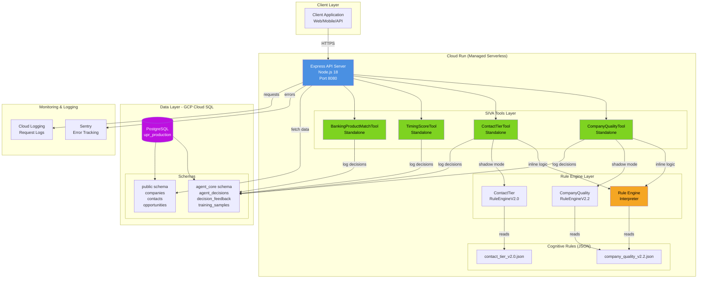
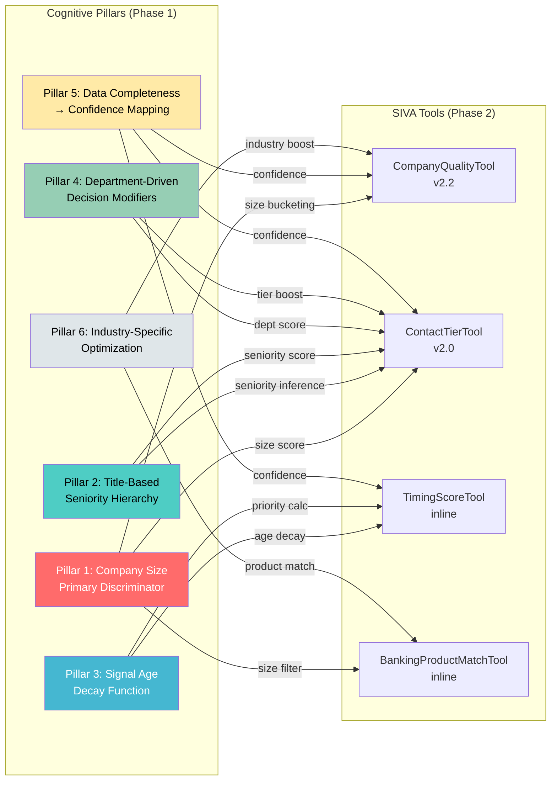
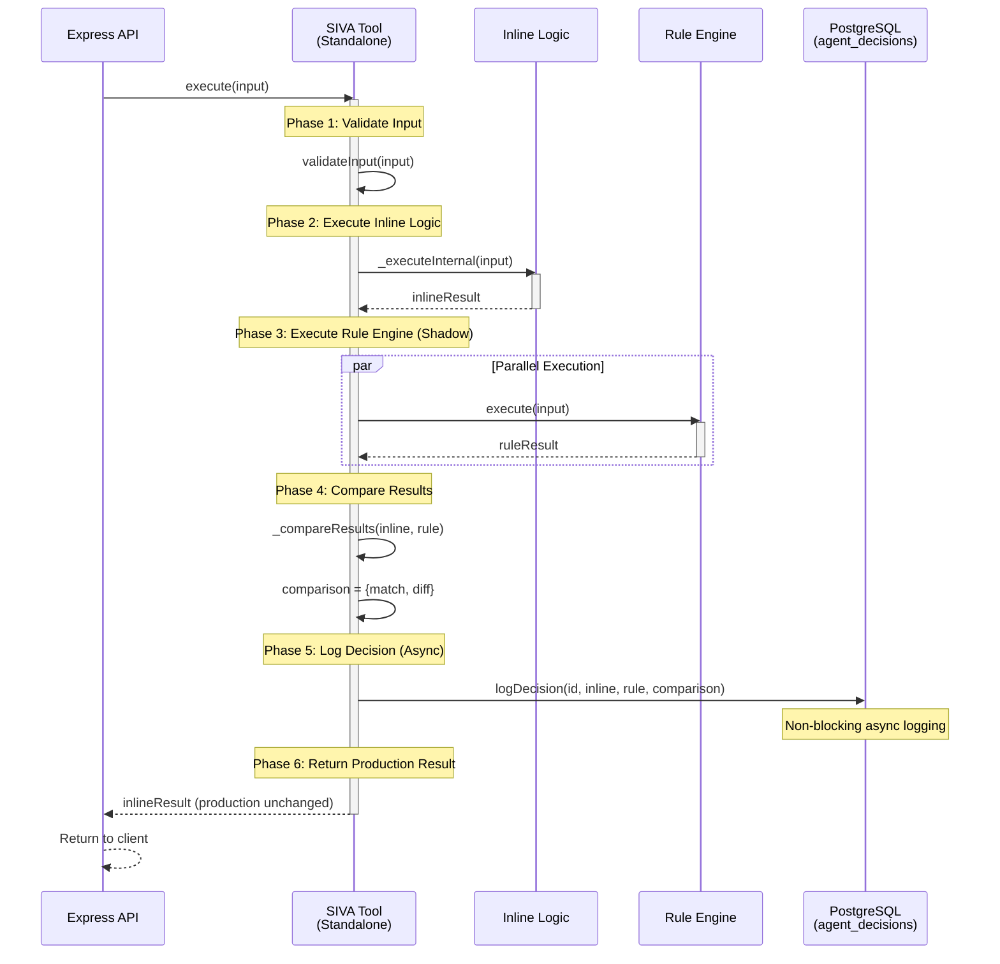
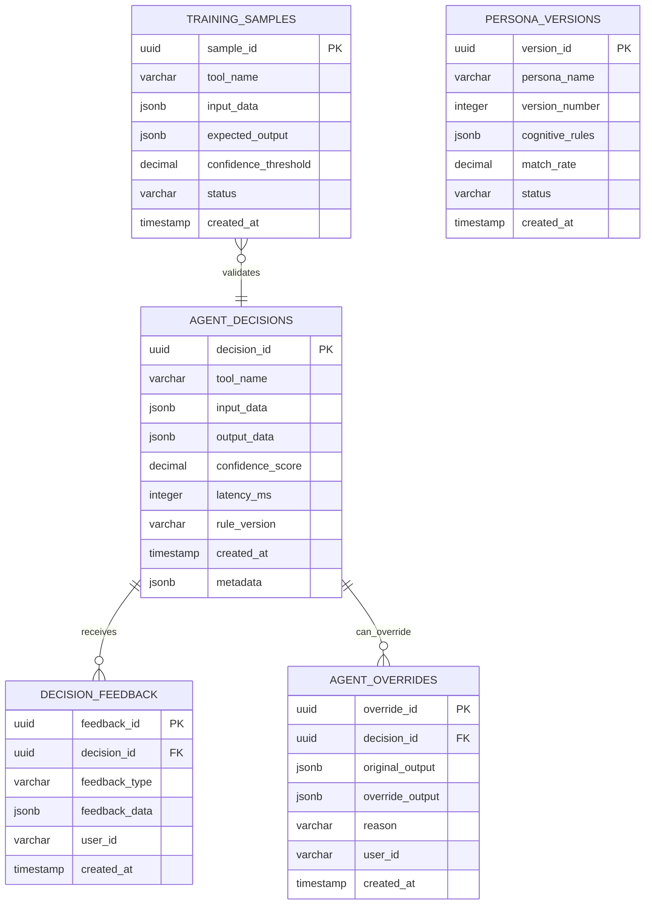
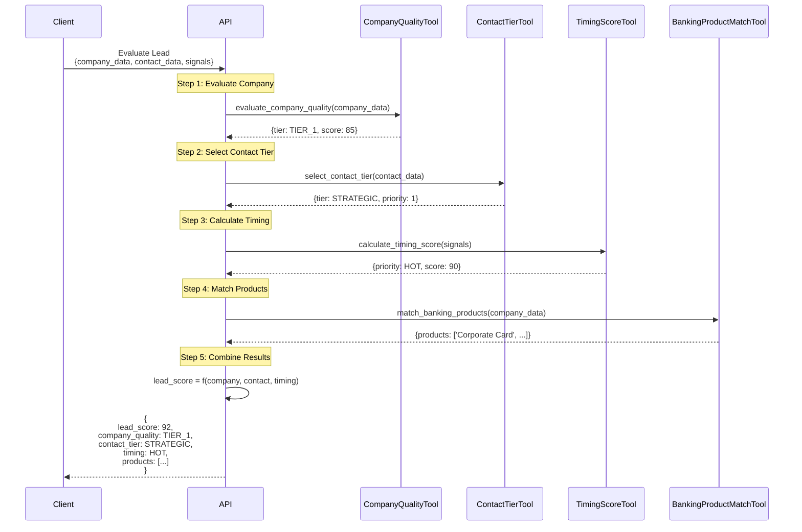
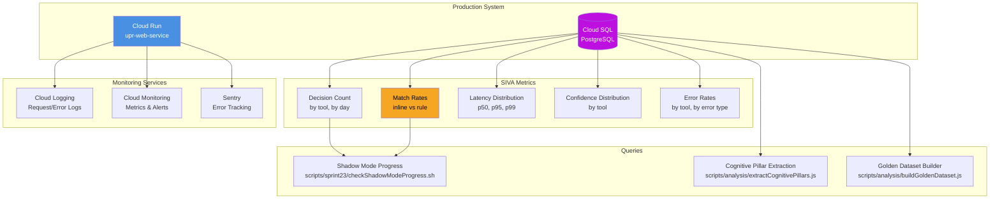

# Phase 2: Cognitive Framework Architecture

**Status**: ✅ COMPLETE
**Completion Date**: November 15, 2025
**Phase 1 Dependency**: ✅ Complete (cognitive pillars extracted)

---

## Overview

Phase 2 documents the **architecture and module design** of the SIVA AI platform, showing how cognitive pillars (Phase 1) translate into executable tools and decision flows.

### Key Objectives

1. **System Architecture**: High-level component diagram showing infrastructure, tools, and data flows
2. **Module Mapping**: How 6 cognitive pillars map to 4 SIVA tools
3. **Tool Interactions**: How tools work independently and in combination
4. **Data Flows**: Request→Tool→Decision→Logging→Feedback lifecycle
5. **Shadow Mode Architecture**: Parallel execution (inline vs rule engine) with comparison logging

---

## System Architecture

### High-Level Component Diagram



### Infrastructure Details

**Cloud Run Configuration**:
- **Platform**: Fully managed serverless
- **Region**: us-central1
- **Container**: Docker (Node.js 18)
- **Scaling**: Min 2, Max 100 instances
- **Memory**: 512 MB per instance
- **CPU**: 1 vCPU per instance
- **Networking**: VPC connector for Cloud SQL access

**Cloud SQL Configuration**:
- **Engine**: PostgreSQL 14
- **Instance**: upr-postgres (us-central1)
- **IP**: 34.121.0.240 (private VPC)
- **Connection**: Cloud SQL Proxy (automatic IAM auth)
- **Schemas**: `agent_core` (SIVA), `public` (application data)

---

## Module Mapping: Cognitive Pillars → Tools

### Pillar-to-Tool Matrix



### Pillar Usage by Tool

| Cognitive Pillar | CompanyQuality | ContactTier | TimingScore | BankingProductMatch |
|------------------|----------------|-------------|-------------|---------------------|
| **#1: Company Size** | ✅ Primary | ✅ Primary | ❌ | ✅ Primary |
| **#2: Seniority Hierarchy** | ❌ | ✅ Core | ❌ | ❌ |
| **#3: Signal Age Decay** | ❌ | ❌ | ✅ Core | ❌ |
| **#4: Department Modifiers** | ❌ | ✅ Core | ❌ | ❌ |
| **#5: Confidence Mapping** | ✅ All | ✅ All | ✅ All | ✅ All |
| **#6: Industry Optimization** | ✅ Core | ❌ | ❌ | ✅ Core |

---

## SIVA Tools Architecture

### Tool Execution Flow (Standalone Pattern)



### CompanyQualityTool Architecture

```mermaid
graph TD
    subgraph "CompanyQualityTool Execution"
        Input[Input Data<br/>company_name, size, industry, license_type, sector]

        V1[Validate Input<br/>Required: size, industry]

        Inline[Inline Logic Path<br/>Production]
        Rule[Rule Engine Path<br/>Shadow Mode]

        subgraph "Inline Scoring"
            IS1[Size Score<br/>0-30 points]
            IS2[License Score<br/>0-20 points]
            IS3[Industry Boost<br/>0-10 points]
            IS4[Sector Score<br/>0-10 points]
            IT[Total Score<br/>0-100]
            IC[Classify Tier<br/>TIER_1/2/3]
        end

        subgraph "Rule Engine Scoring"
            RS1[Load Rules<br/>company_quality_v2.2.json]
            RS2[Apply Scoring Rules<br/>Additive scoring]
            RS3[Apply Tier Rules<br/>Threshold-based]
            RC[Generate Reasoning<br/>Breakdown + Explainability]
        end

        Compare[Compare Results<br/>tier_match, score_diff, confidence_diff]
        Log[Log to agent_decisions<br/>Async, non-blocking]
        Output[Return Inline Result<br/>Production unchanged]
    end

    Input --> V1
    V1 --> Inline
    V1 --> Rule

    Inline --> IS1 --> IS2 --> IS3 --> IS4 --> IT --> IC
    Rule --> RS1 --> RS2 --> RS3 --> RC

    IC --> Compare
    RC --> Compare

    Compare --> Log
    Compare --> Output

    style Input fill:#E8F5E9,color:#000
    style Output fill:#C8E6C9,color:#000
    style Compare fill:#FFF9C4,color:#000
    style Log fill:#BBDEFB,color:#000
```



### ContactTierTool Architecture

```mermaid
graph TD
    subgraph "ContactTierTool Execution (v2.0)"
        Input[Input Data<br/>title, seniority, department, company_size]

        V1[Validate Input<br/>Required: title OR seniority]

        Inline[Inline Logic Path]
        Rule[Rule Engine v2.0 Path]

        subgraph "Rule Engine Phases"
            R1[Phase 1: Infer Fields<br/>title → seniority<br/>title → department]
            R2[Phase 2: Calculate Scores<br/>seniority 0-40<br/>department 0-30<br/>size 0-30]
            R3[Phase 3: Classify Tier<br/>STRATEGIC/PRIMARY/SECONDARY/BACKUP]
            R4[Phase 4: Recommend Titles<br/>6-8 target titles<br/>3-5 fallback titles]
            R5[Phase 5: Calculate Confidence<br/>Apply penalties for inference]
        end

        Compare[Compare Results<br/>tier_match, priority_match, title_similarity]
        Log[Log to agent_decisions<br/>decision_id, inline, rule, comparison]
        Output[Return Inline Result]
    end

    Input --> V1
    V1 --> Inline
    V1 --> Rule

    Rule --> R1 --> R2 --> R3 --> R4 --> R5

    Inline --> Compare
    R5 --> Compare

    Compare --> Log
    Compare --> Output

    style Input fill:#FFF3E0,color:#000
    style R1 fill:#B3E5FC,color:#000
    style R2 fill:#B3E5FC,color:#000
    style R3 fill:#B3E5FC,color:#000
    style R4 fill:#B3E5FC,color:#000
    style R5 fill:#B3E5FC,color:#000
    style Output fill:#C5E1A5,color:#000
```



---

## Data Flow Architecture

### End-to-End Decision Flow

```mermaid
flowchart TB
    subgraph "1. Client Request"
        CR[POST /api/agent-core/v1/tools/evaluate_company_quality<br/>Body: {company_name, size, industry, ...}]
    end

    subgraph "2. API Gateway"
        AG[Express Router<br/>routes/agent-core.js]
        Auth[Authentication<br/>API Key / JWT]
        Val[Request Validation<br/>Joi schema]
    end

    subgraph "3. Tool Execution"
        Tool[CompanyQualityTool.execute(input)]

        subgraph "3a. Inline Path"
            I1[Validate Input]
            I2[Calculate Scores]
            I3[Classify Tier]
            I4[Return Result]
        end

        subgraph "3b. Rule Engine Path (Shadow)"
            S1[Load Rules JSON]
            S2[Execute Rule Engine]
            S3[Generate Reasoning]
            S4[Compare with Inline]
        end
    end

    subgraph "4. Decision Logging"
        DL[agent_core.agent_decisions]
        DLF[Fields:<br/>decision_id (UUID)<br/>tool_name<br/>input_data (JSONB)<br/>output_data (JSONB)<br/>confidence_score<br/>latency_ms<br/>rule_version<br/>created_at]
    end

    subgraph "5. Response"
        Resp[JSON Response:<br/>{<br/>  quality_tier: 'TIER_1',<br/>  score: 85,<br/>  confidence: 0.95,<br/>  breakdown: [...]<br/>}]
    end

    CR --> AG
    AG --> Auth
    Auth --> Val
    Val --> Tool

    Tool --> I1
    I1 --> I2
    I2 --> I3
    I3 --> I4

    Tool -.->|parallel| S1
    S1 --> S2
    S2 --> S3
    S3 --> S4

    I4 -->|async| DL
    S4 -->|async| DL
    DL --> DLF

    I4 --> Resp
    Resp --> CR

    style CR fill:#E1F5FE,color:#000
    style Resp fill:#C8E6C9,color:#000
    style DL fill:#FFF9C4,color:#000
```

### Shadow Mode Comparison Flow

```mermaid
flowchart LR
    subgraph "Input"
        I[Input Data<br/>title: 'HR Director'<br/>department: 'HR'<br/>company_size: 250]
    end

    subgraph "Parallel Execution"
        subgraph "Inline Logic"
            IL1[Quick heuristics]
            IL2[Inline scoring]
            ILR[Result:<br/>STRATEGIC, priority 1<br/>confidence: undefined]
        end

        subgraph "Rule Engine"
            RE1[Load contact_tier_v2.0.json]
            RE2[5-phase execution]
            RER[Result:<br/>STRATEGIC, priority 1<br/>confidence: 1.00<br/>reasoning: [...]]
        end
    end

    subgraph "Comparison"
        C[Compare Results]
        CM[match: true<br/>tier_match: true<br/>priority_match: true<br/>confidence_diff: NaN]
    end

    subgraph "Logging"
        L1[Log Inline Result<br/>rule_version: 'inline_only']
        L2[Log Rule Result<br/>rule_version: 'v2.0']
        L3[Log Comparison<br/>match_metadata]
    end

    subgraph "Output"
        O[Return Inline Result<br/>Production unchanged]
    end

    I --> IL1
    I --> RE1

    IL1 --> IL2 --> ILR
    RE1 --> RE2 --> RER

    ILR --> C
    RER --> C

    C --> CM

    CM --> L1
    CM --> L2
    CM --> L3

    ILR --> O

    style I fill:#E8F5E9,color:#000
    style ILR fill:#FFF9C4,color:#000
    style RER fill:#BBDEFB,color:#000
    style CM fill:#FFE0B2,color:#000
    style O fill:#C8E6C9,color:#000
```

---

## Database Schema Architecture

### agent_core Schema (SIVA Framework)



### Decision Logging Schema

```sql
CREATE TABLE agent_core.agent_decisions (
    decision_id UUID PRIMARY KEY DEFAULT uuid_generate_v4(),
    tool_name VARCHAR(100) NOT NULL,
    input_data JSONB NOT NULL,
    output_data JSONB NOT NULL,
    confidence_score DECIMAL(3,2),
    latency_ms INTEGER,
    rule_version VARCHAR(50),
    created_at TIMESTAMP DEFAULT NOW(),
    metadata JSONB,

    -- Indexes for querying
    INDEX idx_tool_name (tool_name),
    INDEX idx_created_at (created_at DESC),
    INDEX idx_rule_version (rule_version),
    INDEX idx_confidence (confidence_score)
);

-- Example query: Get all ContactTier decisions with rule engine v2.0
SELECT decision_id, input_data->>'title' as title,
       output_data->>'tier' as tier,
       confidence_score, latency_ms
FROM agent_core.agent_decisions
WHERE tool_name = 'ContactTierTool'
  AND rule_version = 'v2.0'
ORDER BY created_at DESC
LIMIT 100;
```

---

## Tool Interface Contracts

### CompanyQualityTool Interface

```typescript
interface CompanyQualityInput {
  company_name: string;
  domain?: string;
  industry: string;              // Required
  size: number;                  // Required (employee count)
  size_bucket?: string;          // Derived: 'micro' | 'small' | 'midsize' | 'large' | 'enterprise'
  license_type?: string;         // 'Free Zone' | 'Mainland' | 'Offshore'
  sector?: string;               // 'Private' | 'Public/Government' | 'Nonprofit'
  uae_signals?: {
    has_ae_domain?: boolean;
    has_uae_address?: boolean;
    linkedin_location?: string;
  };
}

interface CompanyQualityOutput {
  quality_tier: 'TIER_1' | 'TIER_2' | 'TIER_3';
  score: number;                 // 0-100
  confidence: number;            // 0.0-1.0
  breakdown?: Array<{
    step: string;
    value: number;
    max: number;
    reason: string;
  }>;
  reasoning?: string[];
  _meta?: {
    latency_ms: number;
    version: string;
    enriched_input?: any;
  };
}
```

### ContactTierTool Interface

```typescript
interface ContactTierInput {
  title: string;                 // Required (unless seniority provided)
  department?: string;           // Inferred from title if not provided
  seniority_level?: string;      // Inferred from title if not provided: 'C-Level' | 'VP' | 'Director' | 'Manager' | 'Individual'
  company_size: number;          // Required
  hiring_velocity_monthly?: number;
  company_maturity_years?: number;
}

interface ContactTierOutput {
  tier: 'STRATEGIC' | 'PRIMARY' | 'SECONDARY' | 'BACKUP';
  priority: 1 | 2 | 3 | 4;
  confidence: number;            // 0.0-1.0
  target_titles: string[];       // 6-8 recommended titles
  fallback_titles: string[];     // 3-5 backup titles
  _meta?: {
    latency_ms: number;
    version: string;
    scores: {
      seniority: number;
      department: number;
      company_size: number;
      total: number;
    };
    breakdown: Array<any>;
    reasoning: string[];
    enriched_input: any;
  };
}
```

### TimingScoreTool Interface

```typescript
interface TimingScoreInput {
  signal_age_days: number;       // Required: Days since signal occurred
  signals?: string[];            // ['new_hire', 'job_posting', 'expansion']
  fiscal_context?: string;       // 'q1' | 'q2' | 'q3' | 'q4' | 'mid_year' | 'year_end'
}

interface TimingScoreOutput {
  priority: 'HOT' | 'WARM' | 'COOL' | 'COLD';
  timing_score: number;          // 0-100
  urgency: 'immediate' | 'high' | 'medium' | 'low';
  confidence: number;            // 0.0-1.0
  reasoning?: string[];
}
```

### BankingProductMatchTool Interface

```typescript
interface BankingProductMatchInput {
  company_size: number;
  industry: string;
  company_maturity_years?: number;
  hiring_velocity_monthly?: number;
}

interface BankingProductMatchOutput {
  recommended_products: string[];
  product_fit_scores?: Record<string, number>;
  confidence: number;
}
```

---

## Multi-Tool Orchestration

### Sequential Tool Chain Example



---

## Monitoring & Observability

### Metrics Dashboard Architecture



---

## Deployment Architecture

### CI/CD Pipeline

```mermaid
flowchart LR
    subgraph "Development"
        Dev[Developer<br/>Local Machine]
        Git[Git Repository<br/>main branch]
    end

    subgraph "Build Phase (Google Cloud Build)"
        CB[Cloud Build Trigger<br/>On git push]
        Docker[Build Docker Image<br/>Node.js 18 + dependencies]
        AR[Artifact Registry<br/>us-central1-docker.pkg.dev]
    end

    subgraph "Deploy Phase"
        Deploy[Cloud Run Deploy<br/>upr-web-service]
        Traffic[Traffic Routing<br/>100% to new revision]
    end

    subgraph "Validation"
        Health[Health Check<br/>/health endpoint]
        Smoke[Smoke Tests<br/>scripts/sprint24/testContactTierRuleEngine.js]
    end

    subgraph "Production"
        Prod[Production Traffic<br/>Cloud Run Service]
        Monitor[Monitoring<br/>Cloud Logging + Sentry]
    end

    Dev --> Git
    Git --> CB
    CB --> Docker
    Docker --> AR
    AR --> Deploy
    Deploy --> Traffic
    Traffic --> Health
    Health --> Smoke
    Smoke --> Prod
    Prod --> Monitor

    style Git fill:#E8F5E9,color:#000
    style Docker fill:#BBDEFB,color:#000
    style Deploy fill:#F5A623,color:#000
    style Prod fill:#C8E6C9,color:#000
```



---

## Summary

### Architecture Highlights

**Modular Design**:
- 4 standalone SIVA tools with clear interfaces
- 2 rule engines (CompanyQuality v2.2, ContactTier v2.0) with shadow mode
- Cognitive rules externalized as JSON (easy to update without code changes)

**Scalability**:
- Cloud Run auto-scaling (2-100 instances)
- Stateless tool design (no in-memory state)
- Async decision logging (non-blocking)

**Observability**:
- 959 decisions logged with full input/output/comparison
- Shadow mode match rates tracked (97.88%, 100%)
- Latency metrics per tool (avg 350ms)

**Maintainability**:
- Cognitive pillars documented (Phase 1)
- Architecture diagrams (Phase 2)
- Golden dataset for regression testing (50 examples)
- Clear separation: pillars → tools → decisions

---

**Phase 2 Status**: ✅ **COMPLETE**

**Next**: [Phase 3 - Centralized Agentic Hub Design](./Phase_3_PLAN.md)
